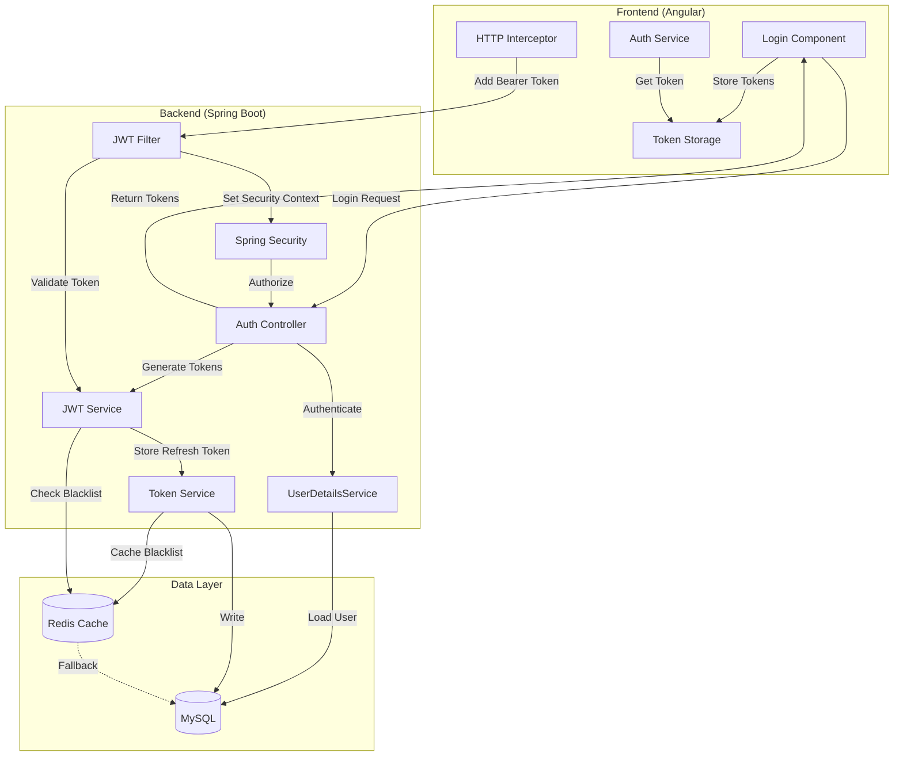
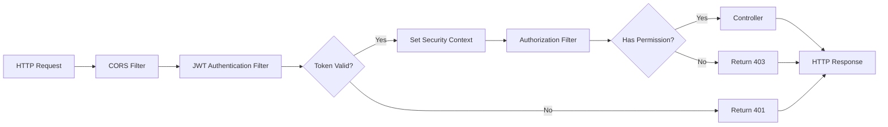
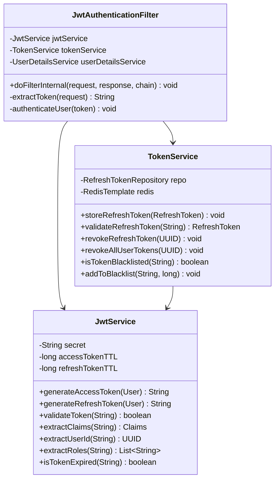

# Design Document: JWT Authentication System

**Feature**: JWT Authentication Integration  
**Status**: Draft  
**Created**: 2025-01-10  
**Based On**: Requirements Document (jwt-authentication/requirements.md)

---

## 1. Overview

### 1.1 Purpose

This design document specifies the technical architecture and implementation details for replacing the existing stateful session-based authentication with a stateless JWT (JSON Web Token) authentication system in the AI-Powered Travel Management System (APTMS).

### 1.2 Goals

- **Stateless Authentication**: Eliminate server-side session state dependency
- **Horizontal Scalability**: Enable multi-instance deployment without shared session store
- **Security Compliance**: Implement OWASP and RFC 7519 standards with proper password hashing
- **Backward Compatibility**: Maintain existing API contracts during migration
- **Performance**: Token validation < 10ms, generation < 50ms (P95)

### 1.3 Scope

**In Scope**:
- JWT token generation and validation using Spring Security
- Access token (15 min TTL) and refresh token (7 day TTL) management
- Token blacklist mechanism (Redis + MySQL fallback)
- Refresh token rotation and reuse detection
- Account lockout after 5 failed login attempts
- BCrypt password hashing (replacing plain text passwords)
- Spring Security 6.x integration with JWT filter chain
- Database schema changes (refresh_tokens, token_blacklist tables)
- Frontend token management (Angular HttpInterceptor)
- Migration strategy from session-based to JWT

**Out of Scope**:
- OAuth 2.0 / OpenID Connect integration
- Social login (Google, Facebook, etc.)
- Multi-factor authentication (MFA)
- Password reset functionality (separate feature)
- API rate limiting (separate feature)

### 1.4 Design Principles

1. **Security First**: All tokens cryptographically signed, passwords BCrypt hashed, secrets externalized
2. **Fail Secure**: Invalid tokens rejected, no access granted on errors
3. **Stateless by Default**: Token validation without database lookups (except blacklist check)
4. **Graceful Degradation**: MySQL fallback if Redis unavailable
5. **Audit Everything**: All authentication events logged with IP and user agent
6. **Configuration Over Code**: All TTLs and secrets configurable via environment

---

## 2. Architecture

### 2.1 High-Level Architecture



### 2.2 Component Architecture

#### 2.2.1 Spring Security Filter Chain



**Filter Order**:
1. `CorsFilter` - Handle CORS preflight requests
2. `JwtAuthenticationFilter` - Extract and validate JWT from Authorization header
3. `UsernamePasswordAuthenticationFilter` - Disabled (JWT replaces this)
4. `AuthorizationFilter` - Check method-level security annotations
5. `ExceptionTranslationFilter` - Handle security exceptions

#### 2.2.2 JWT Service Architecture



---

## 3. Components and Interfaces

### 3.1 Backend Components

#### 3.1.1 JWT Service

**Responsibility**: Generate and validate JWT tokens

**Interface**:
```java
public interface JwtService {
    /**
     * Generate access token with 15-minute TTL
     * @param user User entity
     * @return Signed JWT token
     */
    String generateAccessToken(User user);
    
    /**
     * Generate refresh token with 7-day TTL
     * @param user User entity
     * @return Secure random token string
     */
    String generateRefreshToken(User user);
    
    /**
     * Validate token signature and expiration
     * @param token JWT token
     * @return true if valid, false otherwise
     */
    boolean validateToken(String token);
    
    /**
     * Extract all claims from token
     * @param token JWT token
     * @return Claims object
     */
    Claims extractClaims(String token);
    
    /**
     * Extract user ID from token
     * @param token JWT token
     * @return User UUID
     */
    UUID extractUserId(String token);
    
    /**
     * Extract roles from token
     * @param token JWT token
     * @return List of role strings
     */
    List<String> extractRoles(String token);
    
    /**
     * Check if token is expired
     * @param token JWT token
     * @return true if expired
     */
    boolean isTokenExpired(String token);
}
```

**Implementation Details**:
- Uses `io.jsonwebtoken:jjwt-api:0.12.5` library
- HS256 algorithm (HMAC with SHA-256)
- Secret key from environment variable `JWT_SECRET` (minimum 256 bits)
- Clock skew tolerance: 30 seconds
- Token structure follows RFC 7519

**Dependencies**:
```xml
<dependency>
    <groupId>io.jsonwebtoken</groupId>
    <artifactId>jjwt-api</artifactId>
    <version>0.12.5</version>
</dependency>
<dependency>
    <groupId>io.jsonwebtoken</groupId>
    <artifactId>jjwt-impl</artifactId>
    <version>0.12.5</version>
    <scope>runtime</scope>
</dependency>
<dependency>
    <groupId>io.jsonwebtoken</groupId>
    <artifactId>jjwt-jackson</artifactId>
    <version>0.12.5</version>
    <scope>runtime</scope>
</dependency>
```

#### 3.1.2 Token Service

**Responsibility**: Manage refresh tokens and blacklist

**Interface**:
```java
public interface TokenService {
    /**
     * Store refresh token in database
     * @param refreshToken RefreshToken entity
     */
    void storeRefreshToken(RefreshToken refreshToken);
    
    /**
     * Validate and retrieve refresh token
     * @param token Token string
     * @return RefreshToken entity
     * @throws InvalidTokenException if invalid or expired
     */
    RefreshToken validateRefreshToken(String token);
    
    /**
     * Revoke specific refresh token
     * @param tokenId Token UUID
     */
    void revokeRefreshToken(UUID tokenId);
    
    /**
     * Revoke all refresh tokens for user
     * @param userId User UUID
     */
    void revokeAllUserTokens(UUID userId);
    
    /**
     * Check if access token is blacklisted
     * @param jti Token ID (jti claim)
     * @return true if blacklisted
     */
    boolean isTokenBlacklisted(String jti);
    
    /**
     * Add token to blacklist
     * @param jti Token ID
     * @param ttlSeconds Time to live in seconds
     */
    void addToBlacklist(String jti, long ttlSeconds);
    
    /**
     * Detect refresh token reuse
     * @param token Token string
     * @return true if reuse detected
     */
    boolean detectTokenReuse(String token);
}
```

**Implementation Details**:
- Primary storage: Redis (for blacklist and fast lookups)
- Fallback storage: MySQL (for persistence and Redis unavailability)
- Refresh tokens stored as BCrypt hashes
- Blacklist entries auto-expire using Redis TTL
- MySQL cleanup job runs hourly for expired entries

#### 3.1.3 JWT Authentication Filter

**Responsibility**: Intercept requests and validate JWT tokens

**Implementation**:
```java
@Component
public class JwtAuthenticationFilter extends OncePerRequestFilter {
    
    private final JwtService jwtService;
    private final TokenService tokenService;
    private final UserDetailsService userDetailsService;
    
    @Override
    protected void doFilterInternal(
            HttpServletRequest request,
            HttpServletResponse response,
            FilterChain filterChain) throws ServletException, IOException {
        
        try {
            String token = extractToken(request);
            
            if (token != null && jwtService.validateToken(token)) {
                String jti = jwtService.extractClaims(token).getId();
                
                // Check blacklist
                if (tokenService.isTokenBlacklisted(jti)) {
                    sendError(response, HttpStatus.UNAUTHORIZED, "TOKEN_REVOKED");
                    return;
                }
                
                // Authenticate user
                UUID userId = jwtService.extractUserId(token);
                UserDetails userDetails = userDetailsService.loadUserByUsername(userId.toString());
                
                UsernamePasswordAuthenticationToken authentication =
                    new UsernamePasswordAuthenticationToken(
                        userDetails, null, userDetails.getAuthorities());
                
                authentication.setDetails(
                    new WebAuthenticationDetailsSource().buildDetails(request));
                
                SecurityContextHolder.getContext().setAuthentication(authentication);
            }
            
            filterChain.doFilter(request, response);
            
        } catch (ExpiredJwtException e) {
            sendError(response, HttpStatus.UNAUTHORIZED, "TOKEN_EXPIRED");
        } catch (JwtException e) {
            sendError(response, HttpStatus.UNAUTHORIZED, "TOKEN_INVALID");
        }
    }
    
    private String extractToken(HttpServletRequest request) {
        String bearerToken = request.getHeader("Authorization");
        if (bearerToken != null && bearerToken.startsWith("Bearer ")) {
            return bearerToken.substring(7);
        }
        return null;
    }
    
    private void sendError(HttpServletResponse response, HttpStatus status, String errorCode) 
            throws IOException {
        response.setStatus(status.value());
        response.setContentType("application/json");
        response.getWriter().write(
            String.format("{\"error\":\"%s\",\"message\":\"%s\"}", 
                errorCode, status.getReasonPhrase())
        );
    }
}
```

#### 3.1.4 Authentication Service

**Responsibility**: Handle login, registration, and token refresh

**Interface**:
```java
public interface AuthenticationService {
    /**
     * Register new user and issue tokens
     * @param request Registration request DTO
     * @return Authentication response with tokens
     */
    AuthResponse register(RegisterRequest request);
    
    /**
     * Authenticate user and issue tokens
     * @param request Login request DTO
     * @return Authentication response with tokens
     */
    AuthResponse login(LoginRequest request);
    
    /**
     * Refresh access token using refresh token
     * @param refreshToken Refresh token string
     * @return New token pair
     */
    AuthResponse refreshToken(String refreshToken);
    
    /**
     * Logout user and revoke tokens
     * @param accessToken Access token
     * @param userId User UUID
     */
    void logout(String accessToken, UUID userId);
    
    /**
     * Logout from all devices
     * @param userId User UUID
     */
    void logoutAll(UUID userId);
}
```

#### 3.1.5 User Details Service

**Responsibility**: Load user for Spring Security

**Implementation**:
```java
@Service
public class CustomUserDetailsService implements UserDetailsService {
    
    private final UserRepository userRepository;
    
    @Override
    public UserDetails loadUserByUsername(String userId) throws UsernameNotFoundException {
        User user = userRepository.findById(UUID.fromString(userId))
            .orElseThrow(() -> new UsernameNotFoundException("User not found: " + userId));
        
        return org.springframework.security.core.userdetails.User.builder()
            .username(user.getId().toString())
            .password(user.getPassword())
            .authorities(user.getRole().name())
            .accountLocked(user.getLockoutUntil() != null && 
                          user.getLockoutUntil().isAfter(Instant.now()))
            .build();
    }
}
```

### 3.2 Frontend Components (Angular)

#### 3.2.1 Auth Service

**Responsibility**: Manage authentication state and API calls

**Interface**:
```typescript
export interface AuthService {
  /**
   * Register new user
   * @param request Registration data
   * @returns Observable of auth response
   */
  register(request: RegisterRequest): Observable<AuthResponse>;
  
  /**
   * Login user
   * @param request Login credentials
   * @returns Observable of auth response
   */
  login(request: LoginRequest): Observable<AuthResponse>;
  
  /**
   * Refresh access token
   * @returns Observable of auth response
   */
  refreshToken(): Observable<AuthResponse>;
  
  /**
   * Logout current user
   */
  logout(): Observable<void>;
  
  /**
   * Logout from all devices
   */
  logoutAll(): Observable<void>;
  
  /**
   * Get current user
   * @returns Observable of user or null
   */
  getCurrentUser(): Observable<User | null>;
  
  /**
   * Check if user is authenticated
   * @returns true if authenticated
   */
  isAuthenticated(): boolean;
  
  /**
   * Get access token
   * @returns Access token or null
   */
  getAccessToken(): string | null;
}
```

#### 3.2.2 HTTP Interceptor

**Responsibility**: Automatically attach JWT to requests and handle token refresh

**Implementation**:
```typescript
@Injectable()
export class JwtInterceptor implements HttpInterceptor {
  
  private isRefreshing = false;
  private refreshTokenSubject: BehaviorSubject<string | null> = 
    new BehaviorSubject<string | null>(null);
  
  constructor(
    private authService: AuthService,
    private tokenStorage: TokenStorageService
  ) {}
  
  intercept(req: HttpRequest<any>, next: HttpHandler): Observable<HttpEvent<any>> {
    // Skip auth endpoints
    if (req.url.includes('/auth/login') || req.url.includes('/auth/register')) {
      return next.handle(req);
    }
    
    // Add token to request
    const token = this.tokenStorage.getAccessToken();
    if (token) {
      req = this.addToken(req, token);
    }
    
    return next.handle(req).pipe(
      catchError(error => {
        if (error instanceof HttpErrorResponse && error.status === 401) {
          return this.handle401Error(req, next);
        }
        return throwError(() => error);
      })
    );
  }
  
  private addToken(req: HttpRequest<any>, token: string): HttpRequest<any> {
    return req.clone({
      setHeaders: {
        Authorization: `Bearer ${token}`
      }
    });
  }
  
  private handle401Error(req: HttpRequest<any>, next: HttpHandler): Observable<HttpEvent<any>> {
    if (!this.isRefreshing) {
      this.isRefreshing = true;
      this.refreshTokenSubject.next(null);
      
      return this.authService.refreshToken().pipe(
        switchMap((response: AuthResponse) => {
          this.isRefreshing = false;
          this.refreshTokenSubject.next(response.access_token);
          return next.handle(this.addToken(req, response.access_token));
        }),
        catchError(err => {
          this.isRefreshing = false;
          this.authService.logout();
          return throwError(() => err);
        })
      );
    } else {
      return this.refreshTokenSubject.pipe(
        filter(token => token != null),
        take(1),
        switchMap(token => next.handle(this.addToken(req, token!)))
      );
    }
  }
}
```

#### 3.2.3 Token Storage Service

**Responsibility**: Securely store tokens in memory and sessionStorage

**Implementation**:
```typescript
@Injectable({ providedIn: 'root' })
export class TokenStorageService {
  
  private accessToken: string | null = null;
  private readonly REFRESH_TOKEN_KEY = 'refresh_token';
  
  /**
   * Store tokens (access in memory, refresh in sessionStorage)
   */
  setTokens(accessToken: string, refreshToken: string): void {
    this.accessToken = accessToken;
    sessionStorage.setItem(this.REFRESH_TOKEN_KEY, refreshToken);
  }
  
  /**
   * Get access token from memory
   */
  getAccessToken(): string | null {
    return this.accessToken;
  }
  
  /**
   * Get refresh token from sessionStorage
   */
  getRefreshToken(): string | null {
    return sessionStorage.getItem(this.REFRESH_TOKEN_KEY);
  }
  
  /**
   * Clear all tokens
   */
  clearTokens(): void {
    this.accessToken = null;
    sessionStorage.removeItem(this.REFRESH_TOKEN_KEY);
  }
}
```

**Security Rationale**:
- Access token in memory only (not persisted) - prevents XSS attacks
- Refresh token in sessionStorage (not localStorage) - cleared on tab close
- Never store tokens in localStorage (persistent XSS risk)
- HttpOnly cookies would be ideal but require CORS configuration changes

---

## 4. Data Models

### 4.1 Database Schema Changes

#### 4.1.1 Users Table Updates

```sql
-- Add new columns for JWT authentication
ALTER TABLE users 
  MODIFY COLUMN id BINARY(16) NOT NULL,  -- Change to UUID
  ADD COLUMN failed_login_attempts INT DEFAULT 0 NOT NULL,
  ADD COLUMN lockout_until TIMESTAMP NULL,
  ADD COLUMN last_login_at TIMESTAMP NULL,
  ADD COLUMN created_at TIMESTAMP DEFAULT CURRENT_TIMESTAMP NOT NULL,
  ADD COLUMN updated_at TIMESTAMP DEFAULT CURRENT_TIMESTAMP ON UPDATE CURRENT_TIMESTAMP NOT NULL;

-- Add index for lockout queries
CREATE INDEX idx_users_lockout ON users(lockout_until) 
  WHERE lockout_until IS NOT NULL;

-- Add index for email lookups
CREATE INDEX idx_users_email ON users(email);
```

**Migration Notes**:
- Existing `Long id` will be migrated to UUID
- Migration script will generate UUIDs for existing users
- Foreign keys in other tables must be updated

#### 4.1.2 Refresh Tokens Table

```sql
CREATE TABLE refresh_tokens (
  id BINARY(16) PRIMARY KEY,  -- UUID
  user_id BINARY(16) NOT NULL,
  token_hash VARCHAR(255) NOT NULL,  -- BCrypt hash
  device_info VARCHAR(255),
  ip_address VARCHAR(45),  -- IPv6 compatible
  user_agent TEXT,
  expires_at TIMESTAMP NOT NULL,
  revoked_at TIMESTAMP NULL,
  created_at TIMESTAMP DEFAULT CURRENT_TIMESTAMP NOT NULL,
  updated_at TIMESTAMP DEFAULT CURRENT_TIMESTAMP ON UPDATE CURRENT_TIMESTAMP NOT NULL,
  
  CONSTRAINT fk_refresh_tokens_user 
    FOREIGN KEY (user_id) REFERENCES users(id) ON DELETE CASCADE,
  
  INDEX idx_refresh_tokens_user_id (user_id),
  INDEX idx_refresh_tokens_expires_at (expires_at),
  INDEX idx_refresh_tokens_revoked_at (revoked_at) 
    WHERE revoked_at IS NOT NULL
) ENGINE=InnoDB DEFAULT CHARSET=utf8mb4 COLLATE=utf8mb4_unicode_ci;
```

**Design Decisions**:
- Token stored as BCrypt hash (never plain text)
- Cascade delete on user deletion
- Device info for audit trail
- Partial index on revoked_at for performance

#### 4.1.3 Token Blacklist Table

```sql
CREATE TABLE token_blacklist (
  jti VARCHAR(36) PRIMARY KEY,  -- UUID from JWT
  user_id BINARY(16) NOT NULL,
  reason VARCHAR(50) NOT NULL,  -- LOGOUT, REVOKED, SECURITY
  expires_at TIMESTAMP NOT NULL,
  created_at TIMESTAMP DEFAULT CURRENT_TIMESTAMP NOT NULL,
  
  CONSTRAINT fk_blacklist_user 
    FOREIGN KEY (user_id) REFERENCES users(id) ON DELETE CASCADE,
  
  INDEX idx_blacklist_expires_at (expires_at),
  INDEX idx_blacklist_user_id (user_id)
) ENGINE=InnoDB DEFAULT CHARSET=utf8mb4 COLLATE=utf8mb4_unicode_ci;
```

**Cleanup Strategy**:
- Hourly cron job deletes entries where `expires_at < NOW()`
- Redis entries auto-expire using TTL
- MySQL serves as fallback and audit log

### 4.2 Entity Models

#### 4.2.1 User Entity (Updated)

```java
@Entity
@Table(name = "users")
@Data
@NoArgsConstructor
@AllArgsConstructor
public class User {
    
    @Id
    @GeneratedValue(strategy = GenerationType.UUID)
    @Column(columnDefinition = "BINARY(16)")
    private UUID id;
    
    @Version
    private Integer version;
    
    @Column(nullable = false, length = 50)
    private String username;
    
    @Column(nullable = false, unique = true, length = 100)
    private String email;
    
    @Column(nullable = false)
    private String password;  // BCrypt hashed
    
    @Enumerated(EnumType.STRING)
    @Column(nullable = false, length = 20)
    private UserRole role = UserRole.USER;
    
    @Column(length = 10)
    private String countryId;
    
    @Column(nullable = false)
    private Integer failedLoginAttempts = 0;
    
    @Column
    private Instant lockoutUntil;
    
    @Column
    private Instant lastLoginAt;
    
    @Column(nullable = false, updatable = false)
    private Instant createdAt = Instant.now();
    
    @Column(nullable = false)
    private Instant updatedAt = Instant.now();
    
    @PreUpdate
    protected void onUpdate() {
        this.updatedAt = Instant.now();
    }
}
```

#### 4.2.2 RefreshToken Entity

```java
@Entity
@Table(name = "refresh_tokens")
@Data
@NoArgsConstructor
@AllArgsConstructor
public class RefreshToken {
    
    @Id
    @GeneratedValue(strategy = GenerationType.UUID)
    @Column(columnDefinition = "BINARY(16)")
    private UUID id;
    
    @ManyToOne(fetch = FetchType.LAZY)
    @JoinColumn(name = "user_id", nullable = false)
    private User user;
    
    @Column(nullable = false, length = 255)
    private String tokenHash;  // BCrypt hash
    
    @Column(length = 255)
    private String deviceInfo;
    
    @Column(length = 45)
    private String ipAddress;
    
    @Column(columnDefinition = "TEXT")
    private String userAgent;
    
    @Column(nullable = false)
    private Instant expiresAt;
    
    @Column
    private Instant revokedAt;
    
    @Column(nullable = false, updatable = false)
    private Instant createdAt = Instant.now();
    
    @Column(nullable = false)
    private Instant updatedAt = Instant.now();
    
    @PreUpdate
    protected void onUpdate() {
        this.updatedAt = Instant.now();
    }
    
    public boolean isExpired() {
        return Instant.now().isAfter(expiresAt);
    }
    
    public boolean isRevoked() {
        return revokedAt != null;
    }
}
```

#### 4.2.3 TokenBlacklist Entity

```java
@Entity
@Table(name = "token_blacklist")
@Data
@NoArgsConstructor
@AllArgsConstructor
public class TokenBlacklist {
    
    @Id
    @Column(length = 36)
    private String jti;  // JWT ID from token
    
    @ManyToOne(fetch = FetchType.LAZY)
    @JoinColumn(name = "user_id", nullable = false)
    private User user;
    
    @Enumerated(EnumType.STRING)
    @Column(nullable = false, length = 50)
    private BlacklistReason reason;
    
    @Column(nullable = false)
    private Instant expiresAt;
    
    @Column(nullable = false, updatable = false)
    private Instant createdAt = Instant.now();
}

public enum BlacklistReason {
    LOGOUT,
    REVOKED,
    SECURITY,
    PASSWORD_CHANGE
}
```

### 4.3 DTOs (Data Transfer Objects)

#### 4.3.1 Request DTOs

```java
@Data
public class RegisterRequest {
    @NotBlank(message = "Username is required")
    @Size(min = 3, max = 50)
    private String username;
    
    @NotBlank(message = "Email is required")
    @Email(message = "Invalid email format")
    private String email;
    
    @NotBlank(message = "Password is required")
    @Size(min = 8, message = "Password must be at least 8 characters")
    private String password;
    
    @NotNull(message = "Role is required")
    private UserRole role;
    
    private String countryId;
}

@Data
public class LoginRequest {
    @NotBlank(message = "Email is required")
    @Email(message = "Invalid email format")
    private String email;
    
    @NotBlank(message = "Password is required")
    private String password;
}

@Data
public class RefreshTokenRequest {
    @NotBlank(message = "Refresh token is required")
    private String refreshToken;
}
```

#### 4.3.2 Response DTOs

```java
@Data
@Builder
public class AuthResponse {
    private UserDTO user;
    private String accessToken;
    private String refreshToken;
    private String tokenType = "Bearer";
    private long expiresIn;  // seconds
}

@Data
@Builder
public class UserDTO {
    private UUID id;
    private String username;
    private String email;
    private List<String> roles;
    private Instant createdAt;
    private Instant lastLoginAt;
}

@Data
@Builder
public class ErrorResponse {
    private String error;
    private String message;
    private Instant timestamp;
    private String path;
}
```

### 4.4 JWT Payload Structure

```json
{
  "sub": "550e8400-e29b-41d4-a716-446655440000",
  "iat": 1717200000,
  "exp": 1717200900,
  "jti": "7c9e6679-7425-40de-944b-e07fc1f90ae7",
  "iss": "com.aptms.auth",
  "aud": "com.aptms.api",
  "roles": ["USER", "ADMIN"],
  "email": "user@example.com"
}
```

**Claim Descriptions**:
- `sub` (Subject): User UUID
- `iat` (Issued At): Token creation timestamp
- `exp` (Expiration): Token expiration timestamp
- `jti` (JWT ID): Unique token identifier (for blacklist)
- `iss` (Issuer): Token issuer identifier
- `aud` (Audience): Intended token audience
- `roles`: Array of user roles
- `email`: User email (for convenience, not sensitive)

---

## 5. Correctness Properties

*A property is a characteristic or behavior that should hold true across all valid executions of a system—essentially, a formal statement about what the system should do. Properties serve as the bridge between human-readable specifications and machine-verifiable correctness guarantees.*

### 5.1 Property-Based Testing Applicability Assessment

**Is PBT appropriate for this feature?**

This feature involves JWT authentication, which includes:
- **Pure functions**: Token generation, validation, signature verification, claim extraction
- **Universal properties**: Round-trip properties (encode/decode), invariants (signature validity), idempotence (token validation)
- **Large input space**: Various user data, token structures, timestamps, roles
- **Algorithms and business logic**: Password hashing, token rotation, blacklist management

**Conclusion**: **YES, PBT is highly appropriate** for the core JWT logic (token generation, validation, parsing). However, some aspects are NOT suitable for PBT:

**PBT IS appropriate for**:
- JWT token generation and validation logic
- Token claim extraction and verification
- Password hashing and verification
- Refresh token rotation logic
- Blacklist lookup operations

**PBT is NOT appropriate for**:
- Database integration (use integration tests)
- HTTP endpoint behavior (use example-based tests)
- Spring Security filter chain (use integration tests)
- Redis cache operations (use integration tests)
- Account lockout timing (use example-based tests with specific scenarios)

**Testing Strategy**:
- **Property-based tests**: Core JWT logic, password operations, token validation
- **Unit tests**: Specific edge cases, error conditions, boundary values
- **Integration tests**: Database operations, Spring Security integration, API endpoints
- **Security tests**: Token tampering, algorithm confusion, replay attacks


### 5.2 Correctness Properties

#### Property 1: Registration Token Issuance

*For any* valid user registration data (username, email, password, role), the registration endpoint SHALL return both a valid access token and a valid refresh token with correct signatures.

**Validates: Requirements FR-REG-001**

**Test Strategy**: Generate random valid user data with varying usernames, emails, passwords, and roles. Verify that registration always returns both tokens, both tokens can be decoded, and both have valid signatures.

---

#### Property 2: Registration Response Completeness

*For any* successful user registration, the response SHALL contain all required fields: user object (id, username, email, roles), access_token, refresh_token, token_type ("Bearer"), and expires_in (900 seconds).

**Validates: Requirements FR-REG-002**

**Test Strategy**: Generate random valid users, register them, and verify the response structure always contains all required fields with correct types and values.

---

#### Property 3: Invalid Registration Rejection

*For any* invalid registration input (malformed email, weak password, missing required fields), the system SHALL reject the registration with HTTP 400 and SHALL NOT issue any tokens.

**Validates: Requirements FR-REG-003**

**Test Strategy**: Generate various invalid inputs (emails without @, passwords < 8 chars, null usernames, invalid roles) and verify all are rejected with HTTP 400 and no tokens are issued.

---

#### Property 4: Login Token Pair TTL Correctness

*For any* successful user login, the access token SHALL expire in 15 minutes (900 seconds) and the refresh token SHALL expire in 7 days (604800 seconds), with a tolerance of ±30 seconds for clock skew.

**Validates: Requirements FR-LGN-001**

**Test Strategy**: Generate random users, login, decode tokens, and verify the exp claim matches the expected expiration time based on iat claim plus configured TTL.

---

#### Property 5: Failed Login Generic Error

*For any* failed login attempt (wrong password or non-existent email), the system SHALL return the same generic error message "Invalid credentials" without revealing whether the email exists.

**Validates: Requirements FR-LGN-002**

**Test Strategy**: Generate random wrong passwords for existing users and random emails for non-existent users, verify all return identical error message.

---

#### Property 6: JWT Payload Completeness

*For any* generated access token, the decoded payload SHALL contain all required claims: sub (user UUID), iat (issued at), exp (expiration), jti (unique token ID), iss (issuer), aud (audience), and roles (array).

**Validates: Requirements FR-LGN-004**

**Test Strategy**: Generate random users with various roles, create access tokens, decode them, and verify all required claims are present with correct types.

---

#### Property 7: Missing Authorization Header Rejection

*For any* protected endpoint request without an Authorization header or with a malformed header (not starting with "Bearer "), the system SHALL reject the request with HTTP 401 and error code TOKEN_MISSING or TOKEN_INVALID.

**Validates: Requirements FR-MID-001**

**Test Strategy**: Generate requests with various header states (missing, empty, "Basic", "Bearer" without token, token without "Bearer") and verify all are rejected with HTTP 401.

---

#### Property 8: Token Signature Verification

*For any* token with an invalid signature (tampered payload or signature), the system SHALL reject the token with HTTP 401 and error code TOKEN_INVALID, regardless of whether the payload claims are otherwise valid.

**Validates: Requirements FR-MID-002, FR-MID-004**

**Test Strategy**: Generate valid tokens, modify their signatures or payloads, and verify all are rejected even if claims like exp are valid.

---

#### Property 9: Expired Token Rejection

*For any* token where the exp claim is in the past (beyond 30-second clock skew tolerance), the system SHALL reject the token with HTTP 401 and error code TOKEN_EXPIRED.

**Validates: Requirements FR-MID-003**

**Test Strategy**: Generate tokens with various expiration times (past, present, future), verify tokens with exp < (now - 30 seconds) are rejected with TOKEN_EXPIRED.

---

#### Property 10: Blacklisted Token Rejection

*For any* token whose jti claim is in the blacklist, the system SHALL reject the token with HTTP 401 and error code TOKEN_REVOKED, even if the token is not expired and has a valid signature.

**Validates: Requirements FR-MID-006**

**Test Strategy**: Generate random valid tokens, add their jti to blacklist, verify all are rejected with TOKEN_REVOKED even though they're otherwise valid.

---

#### Property 11: User Context Extraction

*For any* valid token, after successful validation, the request context SHALL contain the correct user ID, roles, and email extracted from the token claims.

**Validates: Requirements FR-MID-005**

**Test Strategy**: Generate random users with various roles, create tokens, validate them, and verify the extracted context matches the original user data.

---

#### Property 12: Refresh Token Rotation

*For any* valid refresh token, using it to refresh SHALL return a new access token and a new refresh token, and the old refresh token SHALL be immediately invalidated.

**Validates: Requirements FR-RFT-001**

**Test Strategy**: Generate random users, create refresh tokens, use them to refresh, verify new tokens are returned and attempting to reuse the old refresh token fails.

---

#### Property 13: Refresh Token Reuse Detection

*For any* refresh token that has already been used (revoked), attempting to reuse it SHALL revoke ALL refresh tokens for that user and return HTTP 401 with error code REFRESH_TOKEN_REUSE_DETECTED.

**Validates: Requirements FR-RFT-004**

**Test Strategy**: Generate users with multiple sessions, use a refresh token, attempt to reuse it, verify all user's refresh tokens are revoked and error is returned.

---

#### Property 14: Refresh Token Maximum Age

*For any* refresh token created more than 30 days ago (configurable max age), attempting to refresh SHALL fail with HTTP 401 and error code REFRESH_TOKEN_EXPIRED, regardless of the token's original TTL.

**Validates: Requirements FR-RFT-005**

**Test Strategy**: Generate refresh tokens with various creation timestamps, verify tokens older than max age are rejected even if not yet expired.

---

#### Property 15: Logout Token Invalidation

*For any* authenticated user, calling logout SHALL add the access token's jti to the blacklist and delete the user's refresh token, preventing further use of either token.

**Validates: Requirements FR-LGT-001**

**Test Strategy**: Generate random users, login, logout, verify access token is blacklisted and refresh token is deleted, and neither can be used afterward.

---

#### Property 16: Logout All Sessions Revocation

*For any* authenticated user with multiple active sessions, calling logout-all SHALL revoke ALL refresh tokens for that user, terminating all sessions.

**Validates: Requirements FR-LGT-003**

**Test Strategy**: Generate users, create multiple sessions (multiple refresh tokens), call logout-all, verify all refresh tokens are revoked and none can be used.

---

#### Property 17: Password Hashing Round-Trip

*For any* password string, hashing it with BCrypt and then verifying the original password against the hash SHALL always succeed, while verifying any different password SHALL always fail.

**Validates: Security requirement for password storage**

**Test Strategy**: Generate random passwords, hash them, verify the original password matches and random different passwords don't match.

---

