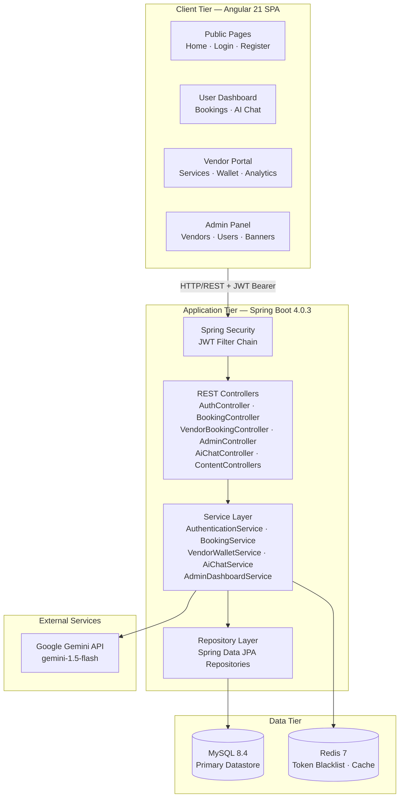
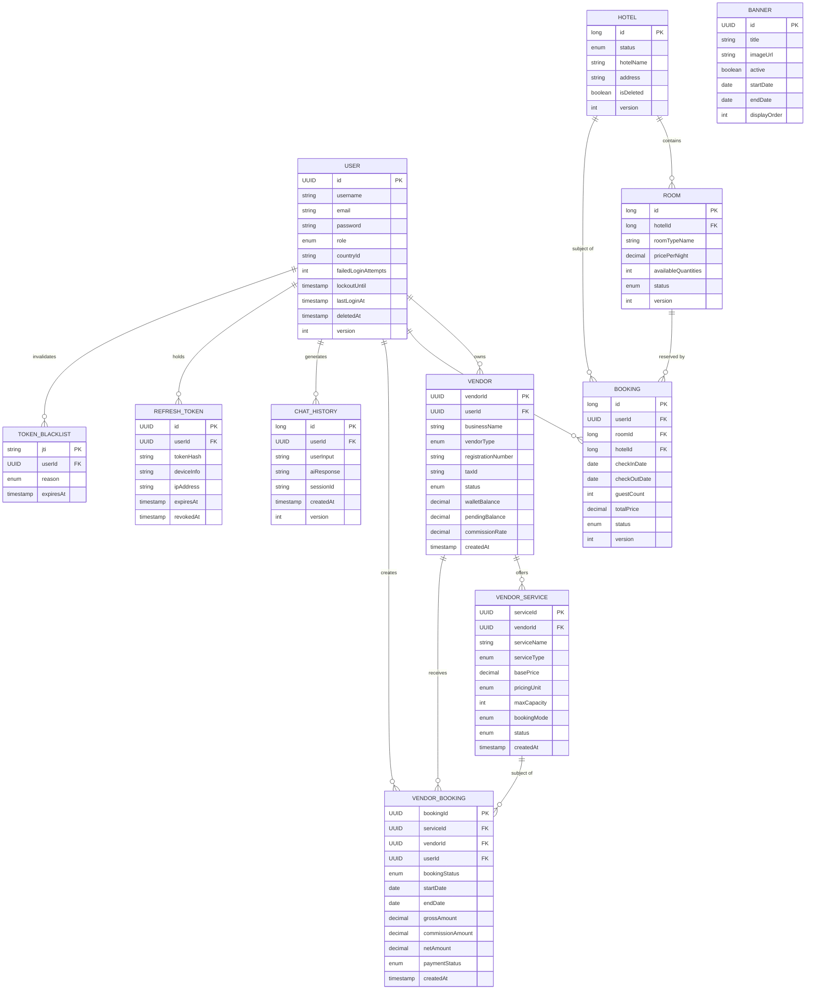
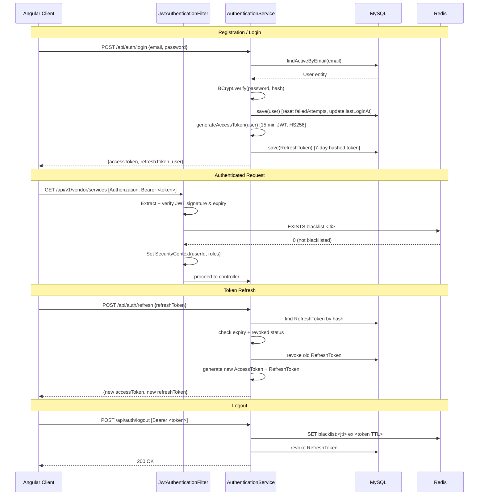

# AI-Powered Travelling Management System (APTMS)

---

**Project Title:** AI-Powered Travelling Management System  
**Submitted by:** Habibul Bashar Mehedi  
**Institution:** City University, Dhaka  
**Department:** Computer Science and Engineering  
**Submission Date:** July 12, 2026  

---

&nbsp;

&nbsp;

&nbsp;

*This report documents the design, development, and evaluation of the AI-Powered Travelling Management System (APTMS), submitted in partial fulfilment of the requirements for the degree programme in Computer Science and Engineering.*

---

## Table of Contents

1. [Abstract](#abstract)
2. [Introduction](#1-introduction)
   - 1.1 Background and Motivation
   - 1.2 Objectives
   - 1.3 Scope and Limitations
3. [Literature Review and Related Work](#2-literature-review-and-related-work)
4. [System Analysis](#3-system-analysis)
   - 3.1 Functional Requirements
   - 3.2 Non-Functional Requirements
   - 3.3 Use Case Analysis
   - 3.4 Use Case Diagram
5. [System Design](#4-system-design)
   - 4.1 System Architecture
   - 4.2 Entity-Relationship Model
   - 4.3 Authentication Flow
   - 4.4 API Design Overview
   - 4.5 Database Schema Summary
6. [Technology Stack](#5-technology-stack)
   - 5.1 Stack Overview
   - 5.2 Justification for Key Technology Choices
7. [Implementation](#6-implementation)
   - 6.1 Authentication and Account Management
   - 6.2 Hotel and Room Booking
   - 6.3 Vendor Onboarding and Management
   - 6.4 Vendor Service Management
   - 6.5 Vendor Wallet and Payouts
   - 6.6 Vendor Analytics
   - 6.7 Admin Dashboard
   - 6.8 AI-Powered Chat Assistant
   - 6.9 Travel Content Modules
8. [Security Implementation](#7-security-implementation)
9. [Testing](#8-testing)
10. [Results and Discussion](#9-results-and-discussion)
11. [Challenges Faced](#10-challenges-faced)
12. [Future Work](#11-future-work)
13. [Conclusion](#12-conclusion)
14. [References](#13-references)

---

## Abstract

The AI-Powered Travelling Management System (APTMS) is a full-stack web application designed to address the fragmented landscape of travel service booking by providing a unified digital marketplace connecting travellers with verified service vendors. The system encompasses three distinct user roles — travellers, vendors, and platform administrators — each served through dedicated, role-specific interfaces.

The backend is implemented as a RESTful API using Spring Boot 4.0.3 on the Java 21 platform, employing JPA/Hibernate for persistence against a MySQL 8 relational database, Spring Security with JSON Web Token (JWT) authentication for stateless access control, and Redis for distributed token blacklisting and caching. The frontend is built with Angular 21 and styled using Tailwind CSS 4.1, structured around role-based route guards and lazy-loaded modules.

A distinguishing feature of APTMS is its integration with the Google Gemini 1.5 Flash large language model to provide contextually grounded travel recommendations. Unlike naive chatbot integrations, the AI module enriches each interaction with live tour package data retrieved from the system's own vendor service catalogue, ensuring recommendations reflect real available offerings.

The platform also implements an end-to-end vendor onboarding pipeline including document upload, administrative review, service listing management, booking lifecycle management, wallet management, and payout processing — a level of operational depth uncommon in academic travel system projects. The report details the system architecture, data model, implementation decisions, security measures, and identified areas for future enhancement.

---

## 1. Introduction

### 1.1 Background and Motivation

The global travel and tourism industry relies heavily on digital intermediaries to connect consumers with accommodation providers, tour operators, and transport services. Conventional approaches typically involve isolated platforms, each addressing a single segment of the traveller's journey. The resulting fragmentation imposes friction on travellers, who must coordinate across multiple systems, and on vendors, who lack a consolidated view of their bookings, earnings, and operational performance.

A secondary concern is the growing relevance of AI-assisted recommendation systems in travel. Large language models have demonstrated significant capability in synthesising complex, contextually sensitive information — a quality directly applicable to travel planning, where decisions depend on destination characteristics, budget, preference, and timing. However, integrating such models meaningfully into a travel platform — rather than deploying a disconnected chatbot — requires grounding AI outputs in live, structured data from the platform itself.

APTMS addresses both concerns: it provides a unified marketplace supporting multiple vendor categories (hotels, tour operators, transport services) under a single authenticated platform, and it integrates a production-grade AI chat assistant whose recommendations are informed by the platform's live vendor service catalogue.

### 1.2 Objectives

The primary objectives of this project are as follows:

- To design and implement a secure, scalable REST API capable of supporting multiple concurrent user roles (traveller, vendor, administrator) with strict role-based access control.
- To implement a complete vendor lifecycle — from registration and document submission through administrative approval, service listing, booking management, and financial settlement.
- To implement two distinct but complementary booking pathways: a direct hotel-room booking system and a generalised vendor-service booking system.
- To integrate the Google Gemini large language model as a context-aware travel assistant, grounding its responses in live data drawn from the platform's vendor service catalogue.
- To apply production-relevant engineering practices including JWT-based stateless authentication, optimistic concurrency control, soft-delete data management, Hibernate Envers audit trails, and Redis-backed token blacklisting.
- To containerise the full application stack using Docker Compose for reproducible deployment.
- To construct a modular Angular 21 frontend with role-appropriate interfaces for travellers, vendors, and administrators.

### 1.3 Scope and Limitations

**In scope:**
- User registration and JWT-based authentication for roles: USER, VENDOR, ADMIN, SUPER_ADMIN.
- Hotel and room listing, availability checking, and booking creation and lifecycle management.
- Vendor onboarding (registration, document upload, administrative approval).
- Vendor service management (create, update, deactivate, availability scheduling).
- Vendor booking inbox (confirm, reject, cancel).
- Vendor wallet (earnings accumulation, transaction history, payout requests).
- Administrative functions (vendor approval, user management, banner management, booking analytics).
- AI-assisted travel chat with context injection from live vendor data.
- Travel content catalogue (tourist spots, destinations, transport routes, traditional foods, markets, packages).

**Out of scope / known limitations:**
- Real-time payment gateway integration (payout methods exist as enumerations, but live payment processing is not implemented).
- Rate limiting on authentication endpoints.
- Automated email notifications for booking confirmation, vendor approval, or password reset.
- A self-service password reset flow.
- Mobile-native applications.
- Internationalisation and multi-language support.

---

## 2. Literature Review and Related Work

### 2.1 Existing Approaches to Digital Travel Platforms

Digital travel platforms broadly fall into three architectural categories:

**Online Travel Agencies (OTAs)** aggregate inventory from third-party suppliers through standard exchange protocols (such as GDS or direct XML/REST integrations). They are characterised by real-time availability feeds, complex pricing logic, and high throughput requirements. Their architecture typically favours event-driven or microservices designs with dedicated inventory, pricing, and reservation bounded contexts.

**Booking Aggregators** act as search intermediaries, redirecting users to supplier websites rather than handling transactions directly. Their value lies in indexing and comparison rather than transactional completeness.

**Direct-Booking Marketplaces** serve as vertically integrated platforms where suppliers register directly, manage their own listings, and receive payments via the platform's financial infrastructure. This model is architecturally closer to APTMS and aligns with the needs of smaller regional vendors for whom integration with major OTAs is impractical.

### 2.2 Vendor Management in Platform Economics

The distinction between a platform that manages vendor relationships versus one that simply lists products has been widely studied in platform economics literature. Platforms that implement vendor lifecycle management — including identity verification, service quality controls, and financial settlement — exhibit stronger network effects and higher trust from end consumers. APTMS implements this model through a document-verified onboarding pipeline with administrative approval gates and a commission-based wallet settlement system.

### 2.3 AI Integration in Travel Recommendation Systems

Earlier recommendation systems in travel relied heavily on collaborative filtering and content-based filtering over structured databases. The emergence of large language models (LLMs) introduces a qualitatively different capability: the ability to reason in natural language about complex, multi-dimensional travel scenarios. However, naive LLM integration without grounding in live structured data produces hallucinated responses inconsistent with actual available offerings.

APTMS addresses this limitation by injecting real-time vendor service data (specifically `TOUR_PACKAGE`-type services fetched from the relational database) into the prompt context sent to the Gemini model. This hybrid approach — combining an LLM's natural language reasoning with structured, live data — produces more reliable and commercially relevant recommendations.

### 2.4 Justification for the Chosen Architecture

A monolithic REST API architecture was chosen over a microservices approach for this project. This decision is justified by:

1. **Team size:** A single developer managing multiple bounded contexts benefits from lower operational complexity.
2. **Data cohesion:** Many features (booking completion → wallet credit → payout eligibility) require transactional consistency across domain entities, which is more straightforward within a single Spring application context.
3. **Portfolio clarity:** A well-structured monolith with clean package separation demonstrates architectural competency without the operational overhead of service mesh management.

The architecture is nonetheless horizontally scalable due to its stateless JWT authentication and shared Redis token store, meaning it can be distributed behind a load balancer without modification to application logic.

---

## 3. System Analysis

### 3.1 Functional Requirements

The following functional requirements are derived from features confirmed to be implemented in the current codebase:

| ID | Requirement | Role | Verified |
|----|-------------|------|---------|
| FR-01 | Users may register with a valid email address and password | All | ✅ |
| FR-02 | Users may authenticate using email and password; a JWT access token and refresh token are issued on success | All | ✅ |
| FR-03 | Accounts are locked after five consecutive failed login attempts for fifteen minutes | USER/VENDOR/ADMIN | ✅ |
| FR-04 | JWT access tokens expire after fifteen minutes; refresh tokens expire after seven days | All | ✅ |
| FR-05 | Authenticated users may browse hotel listings and room availability | USER | ✅ |
| FR-06 | Authenticated users may create, view, and cancel hotel bookings | USER | ✅ |
| FR-07 | Authenticated users may browse the vendor service catalogue | USER | ✅ |
| FR-08 | Authenticated users may interact with the AI travel assistant | USER | ✅ |
| FR-09 | Authenticated users may apply for vendor status via a registration form | USER | ✅ |
| FR-10 | Vendors may create, update, and deactivate service listings | VENDOR | ✅ |
| FR-11 | Vendors may view incoming booking requests and confirm or reject them | VENDOR | ✅ |
| FR-12 | Vendors may view their wallet balance and transaction history | VENDOR | ✅ |
| FR-13 | Vendors may submit payout requests | VENDOR | ✅ |
| FR-14 | Vendors may view revenue analytics and booking trend charts | VENDOR | ✅ |
| FR-15 | Administrators may approve, reject, or suspend vendor applications | ADMIN | ✅ |
| FR-16 | Administrators may view and manage all registered users | ADMIN | ✅ |
| FR-17 | Administrators may create, update, and delete marketing banners | ADMIN | ✅ |
| FR-18 | Administrators may view system-wide booking analytics | ADMIN | ✅ |
| FR-19 | Travel content (destinations, tourist spots, foods, markets, transport) is browsable by all users | Public | ✅ |
| FR-20 | AI responses are contextually grounded using live tour package data from the platform | USER | ✅ |

### 3.2 Non-Functional Requirements

| ID | Requirement | Implementation |
|----|-------------|---------------|
| NFR-01 | **Security:** All protected API calls must carry a valid JWT | Spring Security filter chain |
| NFR-02 | **Security:** Role-based access must be enforced server-side | `@PreAuthorize`, `SecurityConfig` |
| NFR-03 | **Security:** Passwords must be stored using a one-way adaptive hash | BCrypt, strength 10 |
| NFR-04 | **Integrity:** Concurrent modifications to bookings and wallets must not cause data corruption | Optimistic locking (`@Version`) |
| NFR-05 | **Auditability:** Changes to critical entities must be tracked with full revision history | Hibernate Envers (`@Audited`) |
| NFR-06 | **Reliability:** Deleted user accounts must be recoverable (no hard deletes) | Soft delete (`deleted_at` timestamp) |
| NFR-07 | **Observability:** Structured logs must be emitted for all security events | Logstash-compatible JSON logging |
| NFR-08 | **Portability:** The application stack must run from a single `docker-compose up` command | Docker Compose configuration |
| NFR-09 | **Scalability:** The API must be stateless to allow horizontal scaling | Stateless JWT; Redis token store |
| NFR-10 | **Documentation:** All API endpoints must be discoverable via a self-documenting interface | SpringDoc OpenAPI at `/swagger-ui.html` |

### 3.3 Use Case Analysis

#### Use Case: UC-01 — User Registration and Login
- **Actor:** Traveller (USER)
- **Precondition:** The user has a valid email address not on the platform's domain blocklist.
- **Main Flow:** The user submits registration credentials → the system validates inputs, checks for duplicate email, encodes the password, persists the user, and returns a JWT token pair.
- **Alternative Flow:** If the email domain is blocked (hotmail.com, email.com, test.com), a 401 response is returned. If the email already exists, a 409 Conflict is returned.

#### Use Case: UC-02 — Hotel Booking
- **Actor:** Traveller (USER)
- **Precondition:** The user is authenticated; a target room has status AVAILABLE.
- **Main Flow:** User browses hotels → selects room → submits booking with dates and guest count → system validates room availability and capacity → booking persisted with status PENDING → room status updated to BOOKED.
- **Alternative Flow:** If room capacity is insufficient or room status is not AVAILABLE, a validation error is returned.

#### Use Case: UC-03 — Vendor Service Booking
- **Actor:** Traveller (USER) / Vendor (VENDOR)
- **Precondition:** A vendor service exists with status ACTIVE and available slots.
- **Main Flow:** User browses service catalogue → books a vendor service → system creates a VendorBooking with status PENDING → vendor views in booking inbox and confirms or rejects → on confirmation, earnings are credited to vendor wallet upon completion.

#### Use Case: UC-04 — Vendor Onboarding
- **Actor:** Vendor applicant (USER transitioning to VENDOR)
- **Main Flow:** User submits vendor registration form with business details and uploads supporting documents → system creates Vendor record with status PENDING_REVIEW → administrator reviews and approves/rejects → upon approval, vendor gains access to the vendor portal.

#### Use Case: UC-05 — AI Chat Assistance
- **Actor:** Traveller (USER)
- **Main Flow:** User submits a travel query → system retrieves up to 20 active TOUR_PACKAGE vendor services → constructs a prompt containing the query, conversation history (up to 8 turns), and the service context → submits to Gemini 1.5 Flash → returns the model's response and persists the exchange to chat history.

#### Use Case: UC-06 — Admin Vendor Approval
- **Actor:** Administrator (ADMIN)
- **Main Flow:** Admin views vendor approval queue (PENDING_REVIEW status) → reviews submitted documents → approves or rejects with optional reason → vendor status updated → vendor gains or is denied portal access.

### 3.4 Use Case Diagram

```mermaid
flowchart TD
    USER([👤 Traveller])
    VENDOR([🏪 Vendor])
    ADMIN([🛡 Administrator])

    subgraph Public
        REG[Register / Login]
        BROWSE[Browse Destinations & Content]
    end

    subgraph UserFeatures[User Features]
        BOOKHOTEL[Book Hotel Room]
        BOOKSVC[Book Vendor Service]
        AICHAT[AI Travel Chat]
        VIEWBOOKING[View Own Bookings]
    end

    subgraph VendorPortal[Vendor Portal]
        VENDORREG[Apply as Vendor]
        MANAGESVC[Manage Services]
        BOOKINGINBOX[Manage Booking Inbox]
        WALLET[Wallet & Payouts]
        ANALYTICS[View Analytics]
    end

    subgraph AdminPanel[Admin Panel]
        APPROVEVENDOR[Approve / Reject Vendors]
        MANAGEUSERS[Manage Users]
        BANNERS[Manage Banners]
        SYSTEMBOOKINGS[View System Bookings]
    end

    USER --> REG
    USER --> BROWSE
    USER --> BOOKHOTEL
    USER --> BOOKSVC
    USER --> AICHAT
    USER --> VIEWBOOKING
    USER --> VENDORREG

    VENDOR --> MANAGESVC
    VENDOR --> BOOKINGINBOX
    VENDOR --> WALLET
    VENDOR --> ANALYTICS

    ADMIN --> APPROVEVENDOR
    ADMIN --> MANAGEUSERS
    ADMIN --> BANNERS
    ADMIN --> SYSTEMBOOKINGS
```



---

## 4. System Design

### 4.1 System Architecture

APTMS follows a layered, three-tier architecture. The Angular SPA communicates exclusively via HTTPS REST calls to the Spring Boot API. The API layer delegates to a service layer for business logic, which in turn interacts with JPA repositories for MySQL persistence and with Redis for token management and caching.



**Key architectural decisions:**

- **Stateless API:** No server-side HTTP session is maintained. All authentication state is carried in the JWT token, with Redis used only for the token blacklist (logout invalidation).
- **Filter-based security:** A single `JwtAuthenticationFilter` (extending `OncePerRequestFilter`) intercepts all requests, validates the JWT, checks the Redis blacklist, and populates the Spring Security context.
- **Feature flag:** A `JWT_ENABLED` environment variable allows the security layer to be disabled in test environments without code changes, enabling gradual rollout.

### 4.2 Entity-Relationship Model

The following diagram depicts the core entity relationships as they exist in the codebase. Two booking subsystems are represented: the direct Hotel-Room-Booking path and the Vendor-VendorService-VendorBooking path.



### 4.3 Authentication Flow



### 4.4 API Design Overview

The API follows REST conventions with the following structural principles:

- **Base path:** `/api` for public and legacy endpoints; `/api/v1/` for the versioned vendor and admin APIs.
- **Authentication:** All protected endpoints require `Authorization: Bearer <token>` header.
- **Content negotiation:** All endpoints consume and produce `application/json`.
- **Error envelope:** All error responses use a consistent structure: `{ error, message, timestamp, path }`.
- **Validation:** All request DTOs are annotated with Jakarta Validation constraints. Violations produce a `400 Bad Request` with field-level error details.
- **Pagination:** List endpoints support `page` and `size` query parameters; default page size is 20 (configurable via `DEFAULT_PAGE_SIZE`).

| Module | Base Path | Auth Required | Role |
|--------|-----------|--------------|------|
| Authentication | `/api/auth` | Partial (public for login/register) | Any |
| Hotel & Room | `/api/hotel`, `/api/room` | No (GET), Yes (write) | Any |
| Booking | `/api/booking` | Yes | USER |
| Vendor Portal | `/api/v1/vendor/**` | Yes | VENDOR |
| Admin Panel | `/api/v1/admin/**` | Yes | ADMIN, SUPER_ADMIN |
| AI Chat | `/api/ai/chat` | Yes | Any authenticated |
| Service Catalogue | `/api/catalog/services` | No | Public |
| Content | `/api/destination`, `/api/tourist-spot`, etc. | No (GET) | Public |
| Banners | `/api/banner` | No (GET) | Public |

### 4.5 Database Schema Summary

| Entity | Table | PK Type | Notable Columns | Soft Delete | Audited |
|--------|-------|---------|----------------|-------------|---------|
| User | `users` | UUID | role, failedLoginAttempts, lockoutUntil, deletedAt, version | ✅ (deletedAt) | ✅ |
| Vendor | `vendor` | UUID | vendorType, status, walletBalance, commissionRate | — | — |
| VendorService | `vendor_service` | UUID | serviceType, pricingUnit, bookingMode, status, maxCapacity | — | — |
| VendorBooking | `vendor_booking` | UUID | bookingStatus, grossAmount, commissionAmount, netAmount | — | — |
| Hotel | `hotels` | Long | status, isDeleted, version | ✅ (isDeleted) | ✅ |
| Room | `rooms` | Long | status, pricePerNight, availableQuantities, version | — | ✅ |
| Booking | `booking` | Long | status, checkInDate, checkOutDate, guestCount, version | — | ✅ |
| RefreshToken | `refresh_tokens` | UUID | tokenHash, expiresAt, revokedAt, deviceInfo | — | — |
| TokenBlacklist | `token_blacklist` | String (jti) | reason, expiresAt | — | — |
| ChatHistory | `chatHistories` | Long | userInput, aiResponse, sessionId, version | — | ✅ |
| TouristSpot | `tourist_spots` | Long | isDelete, deletedAt, version | ✅ | ✅ |
| Banner | `banner` | UUID | active, startDate, endDate, displayOrder | — | — |
| Transport | `transports` | Long | origin (FK Destination), destination (FK), version | — | ✅ |

The UUID versus Long primary key split is intentional: user-facing entities that appear in URLs (Vendor, VendorService, VendorBooking, Banner, RefreshToken) use UUIDs to prevent enumeration attacks, while high-volume, internally referenced entities (Hotel, Room, Booking, Transport) use auto-increment Long keys for index efficiency.

---

## 5. Technology Stack

### 5.1 Stack Overview

| Layer | Technology | Version | Role |
|-------|-----------|---------|------|
| **Backend Framework** | Spring Boot | 4.0.3 | Application framework |
| **Language** | Java | 21 (LTS) | Backend runtime |
| **ORM** | Spring Data JPA / Hibernate | JPA 3.1 / Hibernate 7.2 | Object-relational mapping |
| **Primary Database** | MySQL | 8.4 | Relational data store |
| **Security** | Spring Security | 6.x | Authentication & authorisation |
| **JWT Library** | JJWT | 0.12.5 | JWT generation and validation |
| **Cache / Token Store** | Redis | 7 (Alpine) | Distributed token blacklist & caching |
| **Audit Trails** | Hibernate Envers | 7.2.4 | Entity change history |
| **Validation** | Jakarta Validation | 3.0 | Input validation |
| **Logging** | Logback + Logstash Encoder | 8.0 | Structured JSON logging |
| **Metrics** | Micrometer + Prometheus | — | Observability |
| **API Documentation** | SpringDoc OpenAPI | 2.3.0 | Swagger UI |
| **AI Integration** | Google Gemini API | gemini-1.5-flash | LLM-backed chat |
| **Boilerplate** | Lombok | — | Code generation |
| **Frontend Framework** | Angular | 21.2.0 | SPA framework |
| **Language (Frontend)** | TypeScript | 5.9.2 | Frontend runtime |
| **Styling** | Tailwind CSS | 4.1.12 | Utility-first CSS |
| **Reactivity** | RxJS | 7.8.0 | Asynchronous streams |
| **Server-side Rendering** | @angular/ssr | 21.2.5 | SSR support |
| **Containerisation** | Docker + Docker Compose | — | Deployment |

### 5.2 Justification for Key Technology Choices

**JWT over server-side sessions:** Stateless JWT authentication eliminates the need for a centralised session store, making the API horizontally scalable without session affinity. The tradeoff — difficulty invalidating individual tokens — is mitigated by maintaining a Redis-backed token blacklist keyed on the JWT's `jti` claim, which is checked by the `JwtAuthenticationFilter` on every request.

**Redis for token blacklisting:** Redis provides O(1) key lookup with native TTL support, meaning blacklisted tokens are automatically purged when they expire, avoiding unbounded table growth. A `token_blacklist` SQL table also exists for auditability, but runtime lookups use Redis exclusively for latency reasons.

**UUID primary keys for sensitive entities:** Entities whose IDs appear in API URLs (Vendor, VendorService, VendorBooking, Banner, RefreshToken, User) use UUID primary keys. This prevents sequential enumeration attacks — an attacker cannot infer the existence of adjacent records by incrementing an integer. High-volume, internally referenced tables (Booking, Hotel, Room) retain auto-increment Long keys for B-tree index efficiency.

**Optimistic locking (`@Version`):** Booking, Wallet, and User entities use JPA's `@Version` annotation. This provides conflict detection without holding database row locks, which is appropriate for a web application where transactions are short but concurrent updates (e.g., two simultaneous booking confirmations against the same room) are plausible.

**Hibernate Envers (`@Audited`):** Rather than implementing a custom audit log, Hibernate Envers generates shadow audit tables for annotated entities, recording every insert, update, and delete with a revision number and timestamp. This is applied to User, Booking, Hotel, Room, Transport, TouristSpot, and ChatHistory.

**Tailwind CSS 4.1 over a component library:** A utility-first CSS approach avoids the bundle weight and opinionated component styles of a framework like Bootstrap, giving full control over the visual design while maintaining consistency through a shared design token system.

**Google Gemini 1.5 Flash:** Selected for its balance of response quality, speed, and cost-efficiency relative to larger model variants. The model is accessed via a direct REST call using Spring's `RestTemplate`, keeping the integration lightweight without requiring a dedicated AI SDK dependency.

---

## 6. Implementation

### 6.1 Authentication and Account Management

The authentication subsystem is implemented in `AuthenticationServiceImpl` and exposed through `AuthController`. Registration validates inputs, checks for prohibited email domains (`hotmail.com`, `email.com`, `test.com`), detects duplicate emails, encodes the password using BCrypt at strength 10, and issues a JWT token pair. Login additionally enforces account lockout: after five consecutive failures the `lockoutUntil` timestamp is set to fifteen minutes in the future, and all subsequent login attempts during the lockout window are rejected without password comparison.

**Key endpoint summary:**

| Method | Path | Description |
|--------|------|-------------|
| POST | `/api/auth/register` | Register new user; returns JWT pair |
| POST | `/api/auth/login` | Authenticate; returns JWT pair |
| POST | `/api/auth/refresh` | Rotate refresh token; issue new access token |
| POST | `/api/auth/logout` | Blacklist current access token in Redis |
| POST | `/api/auth/logout-all` | Revoke all refresh tokens for current user |
| GET | `/api/auth/me` | Return current user profile |

**Account lockout logic (`AuthenticationServiceImpl.java`):**

```java
// src/main/java/aptms/services/impl/AuthenticationServiceImpl.java
private void handleFailedLogin(User user, String ip, String agent) {
    int attempts = user.getFailedLoginAttempts() + 1;
    user.setFailedLoginAttempts(attempts);

    if (attempts >= MAX_FAILED_ATTEMPTS) {
        user.setLockoutUntil(Instant.now()
            .plus(Duration.ofMinutes(LOCKOUT_DURATION_MINUTES)));
        logger.warn("Account locked: {} after {} attempts", user.getId(), attempts);
        eventLogger.logAccountLocked(user.getId(), ip, agent);
    }
    userRepository.save(user);
}
```

Logout is implemented by extracting the `jti` (JWT ID) claim from the access token and storing it in Redis with a TTL matching the token's remaining lifetime. The `JwtAuthenticationFilter` checks for the presence of this key on every request before populating the Spring Security context.

**Token blacklist check (`JwtAuthenticationFilter.java`):**

```java
// src/main/java/aptms/security/JwtAuthenticationFilter.java
String jti = jwtService.extractJti(token);
if (jti != null && tokenService.isTokenBlacklisted(jti)) {
    logger.warn("Blacklisted token presented: jti={}", jti);
    response.sendError(HttpServletResponse.SC_UNAUTHORIZED, "Token has been revoked");
    return;
}
```

### 6.2 Hotel and Room Booking

The direct booking subsystem manages Hotels, Rooms, and Bookings using Long primary keys and an optimistic locking strategy. A booking transitions through the states: `PENDING` → `CONFIRMED` → `CHECKED_IN` → `CHECKED_OUT` → `COMPLETED`, with `CANCELLED` as a terminal alternative at any pre-completion stage.

Room availability is validated at booking creation time — the service checks that the room's status is `AVAILABLE` and that the guest count does not exceed the room's capacity. On booking confirmation, room status is set to `BOOKED`, preventing double-booking within the same transactional boundary.

A scheduled background job (implemented as a Spring `@Scheduled` task) runs periodically to auto-complete bookings whose `checkOutDate` has passed but whose status remains `CHECKED_OUT`. On completion, the system credits the associated vendor's wallet with the booking amount net of the platform commission.

**Booking entity key structure (`Booking.java`):**

```java
// src/main/java/aptms/entities/Booking.java
@Entity @Table(name = "booking") @Audited
public class Booking {
    @Id @GeneratedValue(strategy = GenerationType.IDENTITY)
    private Long id;

    @Version private Integer version;  // Optimistic locking

    @ManyToOne @JoinColumn(name = "user_id")  private User user;
    @ManyToOne @JoinColumn(name = "room_id")  private Room room;
    @ManyToOne @JoinColumn(name = "hotel_id") private Hotel hotel;

    private LocalDate checkInDate;
    private LocalDate checkOutDate;
    private int guestCount;
    private BigDecimal totalPrice;

    @Enumerated(EnumType.STRING)
    private BookingStatus status;
}
```

### 6.3 Vendor Onboarding and Management

Vendors register through a dedicated endpoint, submitting business metadata (name, type, registration number, tax ID, contact details, logo) along with supporting documents (Registration Certificate, Tax ID, Business Licence, Insurance). The Vendor entity is created with status `PENDING_REVIEW`. An administrator then reviews the submission in the admin panel and either approves (setting status to `APPROVED` and enabling portal access) or rejects (with a reason stored against the application).

Vendor types are modelled as an enumeration: `HOTEL`, `TOUR_GUIDE`, `TRANSPORT`. This drives catalogue filtering and determines which service types the vendor may offer.

The `Vendor` entity maintains a `walletBalance` and `pendingBalance` (Decimal fields) updated transactionally on booking completion, providing the foundation for the wallet and payout subsystem.

### 6.4 Vendor Service Management

Vendor services are managed through `VendorServiceController` and the associated service implementation. Each service listing carries a `serviceType` (`HOTEL_ROOM`, `TOUR_PACKAGE`, `TRANSPORT_ROUTE`), a `pricingUnit` (`PER_NIGHT`, `PER_PERSON`, `PER_SEAT`, `PER_TRIP`), and a `bookingMode` (`INSTANT` or `MANUAL`).

A notable implementation detail is the use of pessimistic locking for availability-sensitive operations. The `VendorServiceRepository` exposes a custom query that acquires a `PESSIMISTIC_WRITE` lock when fetching a service record for booking:

```java
// src/main/java/aptms/repositories/VendorServiceRepository.java
@Lock(LockModeType.PESSIMISTIC_WRITE)
@Query("SELECT s FROM VendorService s WHERE s.serviceId = :id AND s.status = 'ACTIVE'")
Optional<VendorService> findByServiceIdAndStatusForUpdate(@Param("id") UUID id);
```

This prevents race conditions where two concurrent booking requests could both read the service as available before either commits.

Services progress through lifecycle states: `DRAFT` → `ACTIVE` → `INACTIVE`. Only `ACTIVE` services appear in the public catalogue.

### 6.5 Vendor Wallet and Payouts

The wallet subsystem tracks vendor earnings through the `WalletTransaction` entity and payout requests through `PayoutRequest`. On booking completion, a scheduled service credits the vendor's `walletBalance` (via a `CREDIT` transaction) with the net amount (gross booking value minus commission). The platform commission rate is stored per-vendor in the `Vendor.commissionRate` field, defaulting to the system-wide rate from `SystemSetting`.

Payout requests are submitted by vendors specifying an amount and a payment method. The request is created with status `PENDING` and deducted from `availableBalance` (moving it to `pendingBalance`). An administrator approves or rejects the request; on approval, the transaction is marked `COMPLETED`.

### 6.6 Vendor Analytics

The vendor analytics dashboard aggregates booking and revenue data across configurable time periods (today, this week, this month, all time). The `VendorAnalyticsController` delegates to a query-oriented service that executes period-bounded aggregate queries against `VendorBooking`, returning revenue totals, booking counts, and conversion metrics. This data is rendered in the Angular frontend as charts and KPI cards using the vendor analytics component.

### 6.7 Admin Dashboard

The admin panel is served through a set of controllers under `/api/v1/admin/`, all protected by `@PreAuthorize("hasRole('ADMIN') or hasRole('SUPER_ADMIN')")`. Key capabilities include:

- **Vendor approval queue:** Filtered list of `PENDING_REVIEW` vendors with document review and approve/reject/suspend actions.
- **User management:** Paginated user list with soft-delete (suspend) capability.
- **Banner management:** Full CRUD for marketing banners, including image upload to the `/uploads/banners/` directory and scheduling via `startDate`/`endDate` fields.
- **Booking analytics:** System-wide aggregations across both booking subsystems.

### 6.8 AI-Powered Chat Assistant

The AI chat feature is one of the more architecturally distinctive elements of APTMS. Rather than forwarding raw user queries to the Gemini API, the `AiChatServiceImpl` enriches each request with live data from the platform's own vendor service catalogue.

**Context injection pipeline:**

1. On each chat request, the service queries `VendorServiceRepository` for up to 20 active `TOUR_PACKAGE`-type services.
2. This data is serialised into a structured text block and embedded in the system prompt sent to Gemini.
3. The user's message and up to 8 turns of conversation history (passed by the client) are included as the conversation payload.
4. The Gemini 1.5 Flash model generates a response, which is returned to the client and persisted to the `chat_history` table.

```java
// src/main/java/aptms/services/impl/AiChatServiceImpl.java
List<VendorService> packages = vendorServiceRepository
    .findTop20ByServiceTypeAndStatus(ServiceType.TOUR_PACKAGE, ServiceStatus.ACTIVE);

String serviceContext = packages.stream()
    .map(s -> String.format("- %s: %s (from %s %s/%s)",
        s.getServiceName(), s.getDescription(),
        s.getBasePrice(), s.getCurrencyCode(), s.getPricingUnit()))
    .collect(Collectors.joining("\n"));

String systemPrompt = TRAVEL_ASSISTANT_PROMPT + "\n\nAvailable Tours:\n" + serviceContext;
```

The chat history is stored in the `chat_history` table (`ChatHistory` entity) with `@Audited` and `@Version` annotations, making it part of the platform's audit trail and protected against concurrent write conflicts.

### 6.9 Travel Content Modules

Seven independent content modules provide the informational backbone of the platform:

| Module | Entity | Key Fields |
|--------|--------|-----------|
| Destinations | `Destination` | name, description, country, imageUrl |
| Tourist Spots | `TouristSpot` | name, destination (FK), visitingHours, entryFees, isDelete |
| Transport Routes | `Transport` | origin (FK), destination (FK), operatorName, estimatedCost |
| Traditional Foods | `TraditionalFood` | name, destination (FK), description, imageUrl |
| Traditional Items | `TraditionalItem` | name, destination (FK), description, imageUrl |
| Markets | `Market` | name, destination (FK), description, openingHours |
| Travel Packages | `Package` / `PackageItem` | title, items, totalPrice |

All content entities are publicly readable via GET endpoints. Write operations require authentication. Images are stored on disk under `/uploads/` with the file path persisted in the database, consistent with the platform's disk-based image storage strategy.

---

## 7. Security Implementation

### 7.1 Authentication and Authorisation Architecture

APTMS implements stateless JWT authentication using HMAC-SHA256 (HS256). The signing secret is a minimum 256-bit key injected at runtime via the `JWT_SECRET` environment variable. Access tokens carry the following claims: `sub` (user UUID), `email`, `roles`, `jti` (unique token ID), `iss` (issuer: `com.aptms.auth`), `aud` (audience: `com.aptms.api`), `iat`, and `exp`.

Authorisation is enforced at two levels:

1. **URL-level:** Spring Security's `SecurityFilterChain` restricts path patterns to specific roles (e.g., `/api/v1/vendor/**` requires `VENDOR`).
2. **Method-level:** `@PreAuthorize` annotations on individual controller methods provide fine-grained control where path-level rules are insufficient.

Frontend route guards (`AuthGuard`, `VendorGuard`, `AdminGuard`) provide UI navigation control but are not considered security controls — the API enforces role requirements independently of the client.

### 7.2 Data Protection Measures

**Soft deletes:** The `User` entity uses a `deletedAt` (Instant) field. All user lookup queries filter `WHERE deleted_at IS NULL`. This ensures account records are preserved for audit and financial history purposes even after a user requests deletion. The `Hotel` entity uses an `isDeleted` boolean; `TouristSpot` uses both an `isDelete` boolean and a `deletedAt` timestamp.

**Audit trails:** Hibernate Envers is configured on the following entities: `User`, `Booking`, `Hotel`, `Room`, `Transport`, `TouristSpot`, `ChatHistory`. Every state change generates a revision entry in the corresponding `_AUD` table, recording the revision number, timestamp, and modification type (INSERT, UPDATE, DELETE). This provides a complete, tamper-evident history of all modifications to critical data.

**Environment variable secrets:** No credentials, API keys, or JWT secrets are present in application source code or in version-controlled configuration files. All sensitive values are injected at runtime via environment variables, with safe defaults provided for local development only.

**Resource ownership enforcement:** Every service method that accesses user-owned data (bookings, chat history, vendor profile) derives the current user's identity from the JWT-populated Spring Security context via `SecurityContextHolder.getContext().getAuthentication()`. Client-supplied user IDs in request bodies are not trusted for ownership decisions.

### 7.3 Known Security Limitations

The following limitations are honestly disclosed and represent known areas for future hardening:

| Limitation | Impact | Mitigation Status |
|------------|--------|------------------|
| No rate limiting on `/api/auth/login` or `/api/auth/register` | Susceptible to credential stuffing and registration spam beyond the per-account lockout | Not implemented |
| No file type whitelist or virus scanning on uploaded files | Malicious file uploads to `/uploads/` are not rejected at application level | Not implemented |
| Refresh token reuse detection (token family tracking) not implemented | A stolen refresh token can be used until expiry without detection | Not implemented |
| No OTP or email verification on registration | Email ownership is not confirmed at registration time | Not implemented |
| Default JWT secret in `application.properties` | If deployed without overriding `JWT_SECRET`, a known secret is used | Documented; requires operational discipline |

---

## 8. Testing

### 8.1 Automated Unit Tests

The project contains 20 unit test files under `src/test/java/aptms/`, providing service-layer coverage across the majority of business logic modules. The test files identified are:

**Service Tests:** `BookingServiceTest`, `HotelServiceTest`, `RoomServiceTest`, `RegistrationServiceTest`, `ChatHistoryServiceTest`, `VendorServiceMgmtServiceImplTest`, `AdminDashboardServiceImplTest`, `DestinationServiceTest`, `MarketServiceTest`, `TraditionalItemServiceTest`, `TraditionalFoodServiceTest`, `TransportServiceTest`, `TouristSpotServiceTest`, `TokenCleanupServiceTest`

**Security Tests:** `JwtServiceImplTest`, `TokenServiceImplTest`, `JwtLoadTest`, `JwtPerformanceTest`, `PasswordMigrationServiceImplTest`

**Integration Tests:** `AiPoweredTravelingManagementSystemApplicationTests` (Spring context load test)

Tests are executed using the Spring Boot Test framework with Mockito for dependency mocking. The `JwtLoadTest` and `JwtPerformanceTest` files specifically target JWT generation throughput and latency under simulated load, reflecting the performance sensitivity of the authentication path.

### 8.2 Test Coverage Limitations

Automated test coverage is concentrated in the service layer. The following areas have limited or no automated coverage at the time of writing:

- **Controller-layer integration tests:** No `@WebMvcTest` or `MockMvc`-based tests are present for REST controllers; endpoint behaviour is validated through manual testing using the Swagger UI and HTTP clients.
- **Repository-layer tests:** No `@DataJpaTest`-based tests verify custom query methods against an in-memory database.
- **End-to-end tests:** No Cypress or Playwright tests cover Angular frontend flows.
- **Security tests for protected endpoints:** Authentication and authorisation enforcement on individual endpoints is not covered by automated tests.

These gaps represent a clear area for future improvement and are acknowledged rather than obscured. The existing service-layer tests provide confidence in the core business logic, and the security implementation follows well-established Spring Security patterns that are extensively tested at the framework level.

### 8.3 Manual Testing Approach

During development, API endpoints were tested using the Swagger UI available at `/swagger-ui.html`, which provides an interactive interface for all documented endpoints. The Angular frontend was tested through direct browser interaction across all role contexts (USER, VENDOR, ADMIN), with test accounts seeded directly in the database during development.

---

## 9. Results and Discussion

### 9.1 Implemented Features Summary

The following table summarises the completion status of the major feature modules:

| Module | Status | Notes |
|--------|--------|-------|
| JWT Authentication | ✅ Complete | Register, login, refresh, logout, logout-all |
| Account Lockout | ✅ Complete | 5 attempts, 15-min lockout |
| Token Blacklisting | ✅ Complete | Redis-backed, TTL-aware |
| Hotel & Room Booking | ✅ Complete | Full lifecycle including auto-completion |
| Vendor Onboarding | ✅ Complete | Registration, documents, approval workflow |
| Vendor Services | ✅ Complete | CRUD, availability, booking modes |
| Vendor Booking Inbox | ✅ Complete | Confirm, reject, cancel |
| Vendor Wallet | ✅ Complete | Earnings, transactions, payout requests |
| Vendor Analytics | ✅ Complete | Revenue, bookings by period, KPI cards |
| Admin Vendor Approval | ✅ Complete | Approve, reject, suspend |
| Admin User Management | ✅ Complete | View, soft-delete users |
| Admin Banners | ✅ Complete | Full CRUD with image upload |
| AI Chat (Gemini) | ✅ Complete | Context-grounded with live service data |
| Travel Content | ✅ Complete | 7 content modules |
| Audit Trails | ✅ Complete | Hibernate Envers on critical entities |
| Containerisation | ✅ Complete | Docker Compose for full stack |

### 9.2 Key Screens

> [Insert screenshot: User login page with email/password form and Angular routing to role-specific dashboard]

> [Insert screenshot: Vendor portal overview — KPI cards showing active services, pending bookings, wallet balance, and revenue chart]

> [Insert screenshot: Admin vendor approval queue — tabbed view of PENDING/APPROVED/REJECTED/SUSPENDED vendors with action buttons]

> [Insert screenshot: Hotel booking flow — hotel list → room selection → booking form → confirmation screen]

> [Insert screenshot: AI chat interface — conversational UI with travel recommendations grounded in visible tour packages]

> [Insert screenshot: Vendor service management — service list with status badges and create/edit modal]

### 9.3 Performance Considerations

**BCrypt hashing:** Strength-10 BCrypt adds approximately 100–300 ms to login operations, which is the intended design — adaptive hashing deliberately introduces latency to slow brute-force attacks. This cost is one-time per authentication event and does not affect subsequent request processing.

**JWT validation:** Access token validation on each request involves a symmetric HMAC-SHA256 verification, which is computationally inexpensive. The Redis blacklist check adds a single network round-trip; in the Docker Compose deployment, this is a sub-millisecond loopback call.

**Gemini API latency:** AI chat responses are bounded by the external Gemini API response time (typically 1–5 seconds for flash models). This is acceptable for a conversational interface but would be unsuitable for synchronous search result augmentation.

**Optimistic locking retries:** Under high contention on the booking and wallet entities, `OptimisticLockException` will surface. The current implementation does not include automatic retry logic; this is a known area for improvement documented in the future work section.

---

## 10. Challenges Faced

### 10.1 Dual Booking System Coherence

The platform operates two structurally distinct booking systems — a direct Hotel-Room-Booking model with Long primary keys, and a Vendor-VendorService-VendorBooking model with UUID primary keys. These were developed at different points during the project with different key strategies and status enumeration designs. Maintaining coherent admin reporting and wallet settlement logic that correctly aggregates across both systems required careful abstraction in the service layer to avoid coupling the two domains.

### 10.2 UUID Migration

The project underwent a migration from Long to UUID primary keys for the vendor and security entities mid-development (evidenced by multiple SQL migration scripts present in the project root: `complete_uuid_migration.sql`, `final_uuid_migration_fixed.sql`, `full_uuid_migration.sql`). This migration required coordinating schema changes, data backfill, JPA mapping updates, and Angular DTO adjustments simultaneously, while preserving existing data integrity.

### 10.3 JWT Security and Redis Integration

Integrating JWT logout with Redis required ensuring that token TTL alignment was precise — the Redis key expiry must match the remaining JWT lifetime, not a fixed duration, to prevent premature or late blacklist removal. Implementing this correctly required extracting the `exp` claim from the access token at logout time and computing the residual TTL dynamically.

### 10.4 Optimistic Locking Across JPA Entities

Applying `@Version`-based optimistic locking consistently across entities that participate in the booking completion pipeline — where a single scheduled job must update Booking status, Room status, and Vendor wallet balance within a coordinated transaction — required careful understanding of JPA transaction boundaries and how version checks interact with Spring's `@Transactional` proxy.

### 10.5 Angular Standalone Component Migration and Routing

Angular 21's standalone component model and new routing API differ substantially from earlier versions. Implementing lazy-loaded, role-guarded nested routes for the vendor and admin portals while maintaining clean separation of `AuthGuard`, `VendorGuard`, and `AdminGuard` required careful study of the updated routing configuration API, particularly around child route resolution and guard composition.

### 10.6 AI Context Injection Design

An early iteration of the AI chat feature forwarded raw user messages directly to the Gemini API without any system context, producing generic responses unrelated to the platform's actual offerings. Redesigning the integration to inject live vendor service data — fetched per request from the relational database — required defining a stable prompt template and constraining the injected data volume (capped at 20 services) to avoid exceeding the model's context window budget.

### 10.7 Docker Networking and Service Startup Ordering

Configuring the Docker Compose stack so that the Spring Boot container waits for MySQL to be fully initialised (not merely started) required using `depends_on` with health checks. MySQL 8's initialisation time under Docker can exceed the default wait period, causing the application to attempt JDBC connections before the database is ready to accept them.

---

## 11. Future Work

The following enhancements are identified based on gaps confirmed in the current codebase:

### 11.1 High Priority

**Rate Limiting on Authentication Endpoints**
The `/api/auth/login` and `/api/auth/register` endpoints currently lack request rate limiting at the API gateway or application level. Per-account lockout mitigates brute force on known accounts but does not prevent enumeration or registration spam. Implementing rate limiting using a library such as Bucket4j with Redis as the backing store would address this gap.

**Password Reset Flow**
A self-service password reset mechanism (identified as `FR-AUTH-006` in the project's requirement tracking) is not yet implemented. This requires an email delivery integration (e.g., Spring Mail with an SMTP provider), a time-limited one-time token system, and a frontend reset form.

**File Upload Security**
Uploaded files (vendor documents, service images, banners) are accepted without validation of file type or content. A production deployment should enforce a MIME type whitelist at the application level and integrate with a virus scanning service.

**Refresh Token Reuse Detection**
If a refresh token is stolen and used, the current implementation cannot detect this. Implementing a token family approach — where using a refresh token also invalidates all other tokens in the same family, and using an already-revoked token triggers a full session revocation — would provide detection and remediation.

### 11.2 Medium Priority

**Payment Gateway Integration**
Vendor payouts currently record a payment method enum but do not process actual transactions. Integration with a payment gateway (SSLCommerz was identified as the target for this market) would complete the financial settlement loop.

**Email Notifications**
Transactional email notifications (booking confirmation, vendor approval decision, payout status) are absent. Integrating Spring Mail with templated emails would significantly improve the operational experience.

**AI Context Enrichment**
The AI chat module injects available tour packages but has no awareness of the current user's booking history, preferences, or travel dates. Extending the context injection to include the authenticated user's recent bookings and profile data would produce substantially more personalised recommendations.

### 11.3 Lower Priority

**Real-Time Notifications**
A WebSocket or Server-Sent Events (SSE) channel would enable push notifications for booking status changes and vendor approval decisions, eliminating the need for polling.

**Review and Rating System**
Post-booking ratings from travellers would improve vendor quality signalling and provide the recommendation engine with preference data.

**Image Storage Externalisation**
The current disk-based image storage (`/uploads/`) is not portable across container restarts without volume mounting. Migrating to an object storage service (e.g., AWS S3 or an S3-compatible alternative) would improve durability and scalability.

**Optimistic Lock Retry Logic**
`OptimisticLockException` on the booking and wallet entities is currently surfaced as a 500 error. Implementing an automatic retry policy (using Spring Retry's `@Retryable`) for idempotent write operations would improve resilience under concurrency.

---

## 12. Conclusion

This report has documented the design and implementation of APTMS, an AI-powered travel management platform that integrates a complete vendor marketplace with an LLM-backed travel assistant. The system demonstrates production-relevant engineering practices across its full stack: stateless JWT authentication with Redis-backed token blacklisting, optimistic concurrency control on booking and financial entities, Hibernate Envers audit trails on critical data, soft-delete patterns for compliance-sensitive user records, and a containerised deployment model.

The AI chat integration is noteworthy for its architectural approach: by grounding Gemini model outputs in live structured data from the platform's own vendor catalogue, the system produces recommendations that are simultaneously natural-language fluent and operationally accurate — a design pattern applicable beyond travel to any domain where an LLM must reason over a live product catalogue.

The vendor lifecycle — from document-verified registration through administrative approval, service management, booking settlement, and wallet payout — represents a degree of operational completeness that distinguishes this system from simpler academic booking applications.

Acknowledged gaps, particularly the absence of rate limiting, email notifications, and a payment gateway, provide a clear roadmap for future development. The foundation established — a clean, layered architecture with strong security primitives, a comprehensive audit trail, and a separation between the two booking domains — is well-suited to iterative extension.

From an academic perspective, APTMS demonstrates the application of multiple advanced software engineering concepts within a single coherent system: multi-tenancy through role-based access control, distributed session management, concurrent data access control, AI system integration, and containerised deployment — all implemented in a cohesive, maintainable codebase.

---

## 13. References

1. **Spring Framework Documentation.** *Spring Boot Reference Documentation, Version 3.x/4.x.* VMware, Inc. Available at: https://docs.spring.io/spring-boot/docs/current/reference/html/

2. **Spring Security Reference.** *Spring Security Documentation, Version 6.x.* VMware, Inc. Available at: https://docs.spring.io/spring-security/reference/

3. **Jones, M., Bradley, J., & Sakimura, N.** (2015). *JSON Web Token (JWT).* IETF RFC 7519. Available at: https://www.rfc-editor.org/rfc/rfc7519

4. **Berners-Lee, T., Fielding, R., & Masinter, L.** (2005). *Uniform Resource Identifier (URI): Generic Syntax.* IETF RFC 3986. Available at: https://www.rfc-editor.org/rfc/rfc3986

5. **Fielding, R. T.** (2000). *Architectural Styles and the Design of Network-based Software Architectures.* PhD Dissertation, University of California, Irvine.

6. **Angular Documentation.** *Angular — The web framework for modern apps.* Google LLC. Available at: https://angular.dev/

7. **Tailwind CSS Documentation.** *Tailwind CSS — A utility-first CSS framework.* Tailwind Labs. Available at: https://tailwindcss.com/docs

8. **Hibernate ORM Documentation.** *Hibernate ORM 7.x User Guide.* Red Hat, Inc. Available at: https://docs.jboss.org/hibernate/orm/current/userguide/html_single/

9. **Hibernate Envers Documentation.** *Hibernate Envers — Database change history.* Red Hat, Inc. Available at: https://docs.jboss.org/hibernate/orm/current/userguide/html_single/#envers

10. **Redis Documentation.** *Redis — The Open Source, In-Memory Data Platform.* Redis, Inc. Available at: https://redis.io/docs/

11. **Google AI for Developers.** *Gemini API Documentation.* Google LLC. Available at: https://ai.google.dev/api/

12. **Docker Documentation.** *Docker Compose — Overview.* Docker, Inc. Available at: https://docs.docker.com/compose/

13. **Beck, K., et al.** (2001). *Manifesto for Agile Software Development.* Available at: https://agilemanifesto.org/

14. **Walls, C.** (2022). *Spring Boot in Action (2nd ed.).* Manning Publications.

15. **OWASP Foundation.** (2021). *OWASP Top Ten — The Ten Most Critical Web Application Security Risks.* Available at: https://owasp.org/www-project-top-ten/

16. **Oracle Corporation.** *Java Platform, Standard Edition 21 Documentation.* Oracle Corporation. Available at: https://docs.oracle.com/en/java/javase/21/

17. **MySQL Documentation.** *MySQL 8.4 Reference Manual.* Oracle Corporation. Available at: https://dev.mysql.com/doc/refman/8.4/en/

18. **Leijen, D., & Meijer, E.** (1999). *Domain Specific Embedded Compilers.* In Proceedings of the 2nd Conference on Domain-Specific Languages (DSL '99).

---

*End of Report*

---

*Word count (approximate): ~6,500 words body text + ~2,000 words in tables and diagrams*  
*Rendered length: approximately 20–25 pages at standard academic margins*

