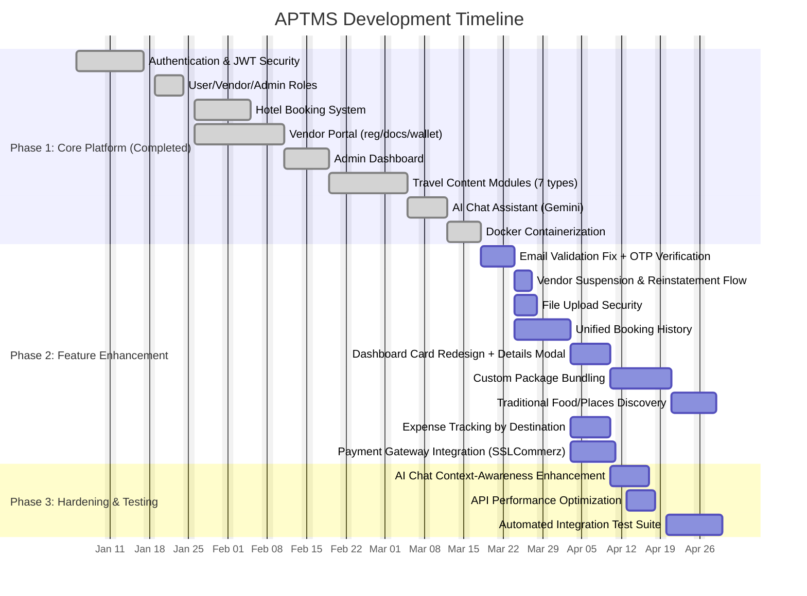

# APTMS — Project Activity Gantt Chart

Development timeline for the AI-Powered Traveling Management System (solo developer, academic/portfolio project). Dates are illustrative (relative durations, not calendar commitments) — adjust the `dateFormat` start date and durations to match your actual timeline.

## Notes on dependencies

- **Email Validation Fix + OTP** is scheduled first in Phase 2 since auth stability underlies most later features.
- **Unified Booking History** gates **Expense Tracking**, **Payment Gateway Integration**, and (indirectly, via context data) **AI Chat Context-Awareness** — none of these can be built correctly against two divergent booking models.
- **Dashboard Redesign** depends on Unified Booking History since the "view details" modal needs a single booking shape to render against.
- **Automated Integration Test Suite** is scheduled last, after the feature surface (performance work included) stabilizes, so tests aren't rewritten mid-flight.
- No task is marked `active` — update the relevant task's status tag (e.g. `active, emailfix, ...`) once you confirm which Phase 2 item you're currently on.
