# Business Requirement Document
## Secure User Registration System with JWT Authentication

> **Document ID:** BRD-AUTH-JWT-001 · **Version:** 1.0 · **Status:** Draft – For Review
> **Prepared By:** Senior Business Analyst · **Date:** June 2025
> **Classification:** CONFIDENTIAL | INTERNAL USE ONLY

---

## Table of Contents

1. [Executive Summary](#1-executive-summary)
2. [Business Objectives](#2-business-objectives)
3. [System Architecture Overview](#3-system-architecture-overview)
4. [Project Scope](#4-project-scope)
5. [Functional Requirements](#5-functional-requirements)
6. [Authentication Flows](#6-authentication-flows)
7. [JWT Token Design](#7-jwt-token-design)
8. [API Endpoint Specification](#8-api-endpoint-specification)
9. [Database Schema Changes](#9-database-schema-changes)
10. [Non-Functional Requirements](#10-non-functional-requirements)
11. [Security Requirements](#11-security-requirements)
12. [Implementation Plan](#12-implementation-plan)
13. [Migration Strategy](#13-migration-strategy)
14. [Testing Requirements](#14-testing-requirements)
15. [Risk Register](#15-risk-register)
16. [Stakeholders & Approval](#16-stakeholders--approval)
17. [Glossary & References](#17-glossary--references)

---

## 1. Executive Summary

The existing login system authenticates users successfully but relies on **stateful session-based authentication** — a model that creates bottlenecks in distributed, horizontally-scaled environments and lacks the standardized security controls required for modern API-driven architectures.

This BRD defines the complete requirements for integrating **JSON Web Token (JWT) Authentication** into the existing registration and login system. The upgrade is additive and non-destructive: the current login flow continues operating in parallel during migration.

| Attribute | Details |
|-----------|---------|
| **Document ID** | BRD-AUTH-JWT-001 |
| **Version** | 1.0 |
| **Status** | Draft – For Review |
| **Project Name** | JWT Authentication Integration |
| **Current State** | Functional login/registration — no JWT |
| **Target State** | Stateless JWT auth with refresh token rotation |
| **Priority** | 🔴 High — Security Critical |
| **Estimated Effort** | 4 Sprint Weeks |
| **Primary Stakeholders** | Engineering, Security, Product, QA, DevOps |

---

## 2. Business Objectives

### 2.1 Primary Objectives

| # | Objective | Rationale |
|---|-----------|-----------|
| O-01 | Replace stateful session cookies with cryptographically signed JWT tokens | Eliminate server-side session state dependency |
| O-02 | Enable stateless authentication for horizontal scaling | No shared session store needed across app servers |
| O-03 | Provide standardized token-based API access control | Uniform auth mechanism for all REST endpoints |
| O-04 | Implement secure refresh token rotation | Maintain sessions without constant re-authentication |
| O-05 | Comply with OWASP and RFC 7519 standards | Meet industry security baselines |

### 2.2 Success Metrics

| KPI | Target | Measurement |
|-----|--------|-------------|
| Token generation latency | < 50ms (P95) | APM dashboards |
| Token validation overhead | < 10ms per request | API gateway metrics |
| Authentication success rate | > 99.9% | System logs |
| JWT-related security incidents | Zero | Security audit logs |
| Session abandonment rate | Reduce by 20% | Analytics platform |

---

## 3. System Architecture Overview

### 3.1 High-Level Architecture

```mermaid
graph TB
    subgraph Client["Client Layer"]
        WEB[Web Browser / SPA]
        MOB[Mobile App]
        API_C[API Consumer / Service]
    end

    subgraph Gateway["API Gateway"]
        RATE[Rate Limiter]
        JWT_MW[JWT Middleware\nValidation]
    end

    subgraph Auth["Auth Service"]
        REG[/auth/register]
        LOGIN[/auth/login]
        REFRESH[/auth/refresh]
        LOGOUT[/auth/logout]
    end

    subgraph Protected["Protected Routes"]
        USER[/api/users]
        PROFILE[/api/profile]
        RESOURCE[/api/resources]
    end

    subgraph DataLayer["Data Layer"]
        DB[(Users DB)]
        RT_DB[(Refresh Tokens)]
        BL_DB[(Token Blacklist)]
        CACHE[(Redis Cache)]
    end

    WEB -->|HTTPS| RATE
    MOB -->|HTTPS| RATE
    API_C -->|HTTPS| RATE

    RATE --> JWT_MW
    JWT_MW -->|Public Routes| Auth
    JWT_MW -->|Validate Token| CACHE
    JWT_MW -->|Protected Routes| Protected

    REG --> DB
    LOGIN --> DB
    REFRESH --> RT_DB
    LOGOUT --> BL_DB
    LOGOUT --> RT_DB

    Protected --> DB
    CACHE -.->|Blacklist Lookup| BL_DB

    style Client fill:#1B3A6B,color:#fff
    style Gateway fill:#2E6FCE,color:#fff
    style Auth fill:#166534,color:#fff
    style Protected fill:#92400E,color:#fff
    style DataLayer fill:#4A4A6B,color:#fff
```

### 3.2 Component Interaction Map

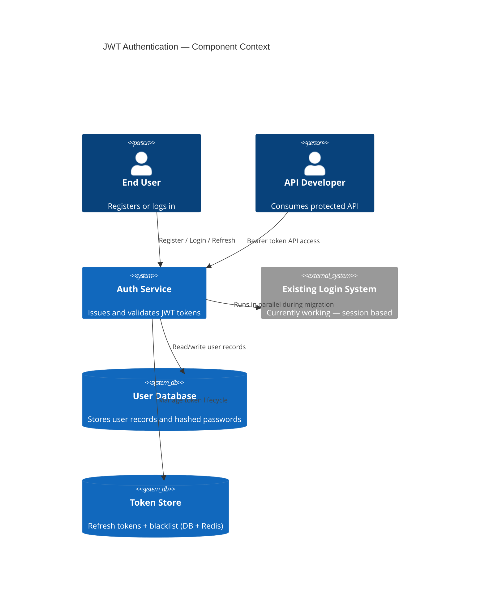

---

## 4. Project Scope

### 4.1 In Scope ✅

- JWT access token + refresh token generation on login and registration
- JWT validation middleware for all protected API routes
- Refresh token rotation with atomic database transactions
- Token revocation (blacklist) on logout
- Role-based claims embedded in JWT payload
- Configurable token TTL via environment variables
- Updated API documentation with Bearer token requirements
- Unit, integration, security, and performance test suites

### 4.2 Out of Scope ❌

- OAuth 2.0 / OpenID Connect (future phase)
- Social login (Google, GitHub, etc.)
- Multi-factor authentication (MFA) — separate project
- Changes to existing registration/login UI
- Third-party Identity Provider (IdP) integration
- Immediate removal of session-based auth (parallel run first)

### 4.3 Assumptions & Constraints

| Type | Assumption | Constraint |
|------|-----------|------------|
| Technical | Backend is Node.js/Express or equivalent REST framework | Must use `jsonwebtoken` library — no custom crypto |
| Security | HTTPS enforced in all environments | JWT secrets stored in env vars only, never in source code |
| Database | Existing user schema can be extended | Refresh tokens must be persisted — no in-memory-only storage |
| Timeline | Dev environment with existing login is accessible | Go-live requires Security team sign-off |
| Compliance | GDPR data handling already in place | Token payload must not contain sensitive PII beyond user ID and roles |

---

## 5. Functional Requirements

### 5.1 User Registration

| Req ID | Requirement | Priority | Category |
|--------|-------------|----------|----------|
| FR-REG-001 | Upon successful registration, system SHALL return a signed JWT access token and refresh token | 🔴 Critical | Security |
| FR-REG-002 | Registration response SHALL include `access_token`, `refresh_token`, `token_type`, and `expires_in` | 🔴 Critical | API Contract |
| FR-REG-003 | All input fields SHALL be validated (email format, password strength) before token issuance | 🔴 Critical | Validation |
| FR-REG-004 | Duplicate email SHALL return HTTP 409 Conflict — no token issued | 🟠 High | Error Handling |
| FR-REG-005 | Registration endpoint SHALL reject non-HTTPS requests with HTTP 403 | 🔴 Critical | Security |

### 5.2 User Login & Token Issuance

| Req ID | Requirement | Priority | Category |
|--------|-------------|----------|----------|
| FR-LGN-001 | Successful login SHALL issue access token (TTL: 15 min default) and refresh token (TTL: 7 days default) | 🔴 Critical | Auth |
| FR-LGN-002 | Failed login SHALL return HTTP 401 with generic message — no account existence leakage | 🔴 Critical | Security |
| FR-LGN-003 | After 5 consecutive failures, account SHALL be locked for 15 minutes | 🟠 High | Security |
| FR-LGN-004 | JWT payload SHALL include: `sub`, `iat`, `exp`, `jti`, `iss`, `aud`, `roles` | 🔴 Critical | Token Design |
| FR-LGN-005 | Signing algorithm (HS256 or RS256) SHALL be configurable via environment variable | 🔴 Critical | Cryptography |

### 5.3 Token Validation Middleware

| Req ID | Requirement | Priority | Category |
|--------|-------------|----------|----------|
| FR-MID-001 | All protected routes SHALL require `Authorization: Bearer <token>` header | 🔴 Critical | Middleware |
| FR-MID-002 | Middleware SHALL verify signature, `exp`, `iss`, and `aud` before granting access | 🔴 Critical | Validation |
| FR-MID-003 | Expired tokens SHALL return HTTP 401 with error code `TOKEN_EXPIRED` | 🔴 Critical | Error Handling |
| FR-MID-004 | Invalid/tampered tokens SHALL return HTTP 401 with error code `TOKEN_INVALID` — no failure details | 🔴 Critical | Security |
| FR-MID-005 | Middleware SHALL attach decoded user payload to request context for downstream handlers | 🟠 High | Architecture |
| FR-MID-006 | Blacklisted tokens SHALL be rejected even if `exp` has not passed | 🔴 Critical | Security |

### 5.4 Refresh Token Management

| Req ID | Requirement | Priority | Category |
|--------|-------------|----------|----------|
| FR-RFT-001 | `/auth/refresh` SHALL accept a valid refresh token and issue a new access token + rotated refresh token | 🔴 Critical | Token Lifecycle |
| FR-RFT-002 | Refresh tokens SHALL be stored as bcrypt hashes in the database, linked to the user | 🔴 Critical | Data Storage |
| FR-RFT-003 | Token rotation SHALL atomically invalidate the previous refresh token on successful refresh | 🟠 High | Security |
| FR-RFT-004 | Reuse of a consumed refresh token SHALL revoke ALL tokens for that user (reuse attack mitigation) | 🔴 Critical | Security |
| FR-RFT-005 | Refresh tokens SHALL have a configurable absolute maximum lifetime (default: 30 days) | 🟠 High | Lifecycle |

### 5.5 Logout & Token Revocation

| Req ID | Requirement | Priority | Category |
|--------|-------------|----------|----------|
| FR-LGT-001 | `/auth/logout` SHALL add the access token's `jti` to the blacklist | 🔴 Critical | Security |
| FR-LGT-002 | Logout SHALL delete the corresponding refresh token record from the database | 🔴 Critical | Data Management |
| FR-LGT-003 | `/auth/logout-all` SHALL revoke all active refresh tokens for the authenticated user | 🟠 High | Security |
| FR-LGT-004 | Blacklist entries SHALL auto-expire after the token's original `exp` time | 🟡 Medium | Performance |

---

## 6. Authentication Flows

### 6.1 Registration Flow

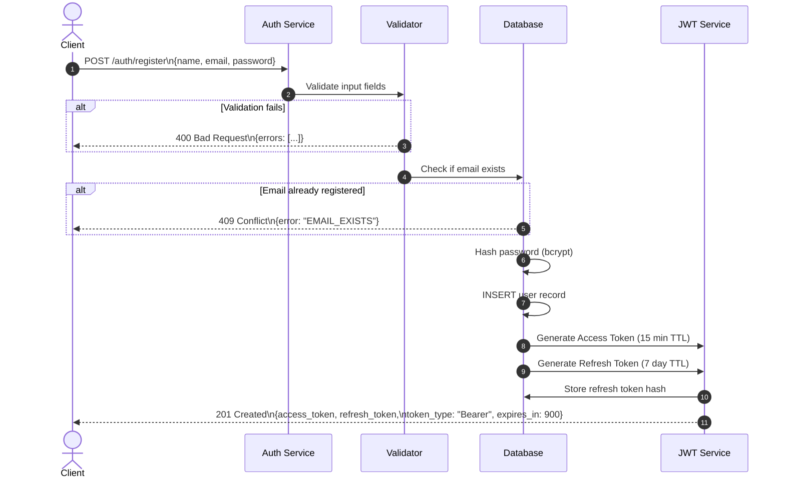

### 6.2 Login Flow

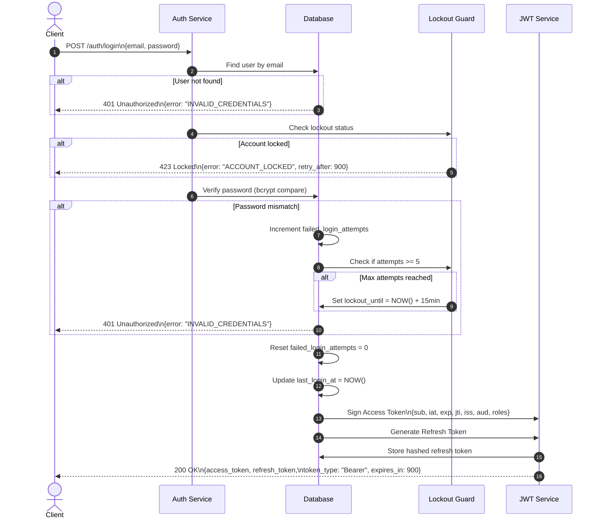

### 6.3 Protected Route Access Flow

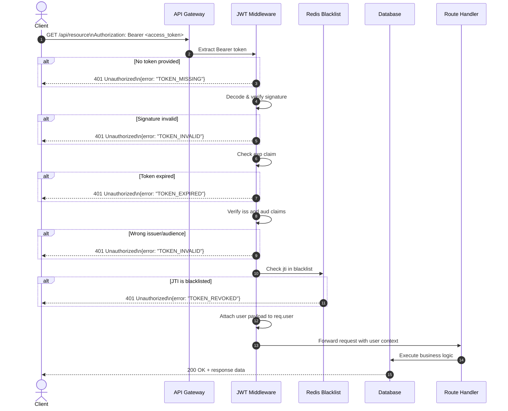

### 6.4 Token Refresh Flow

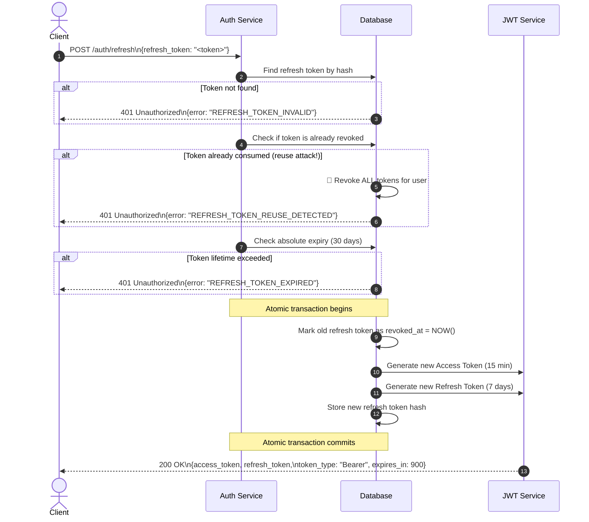

### 6.5 Logout Flow

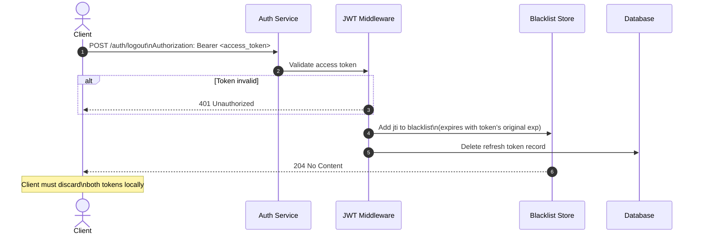

---

## 7. JWT Token Design

### 7.1 Token Structure

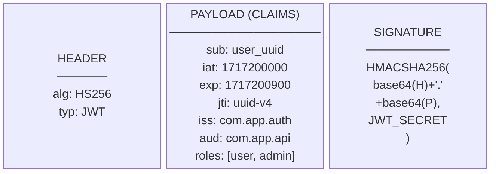

### 7.2 Token Lifecycle State Machine

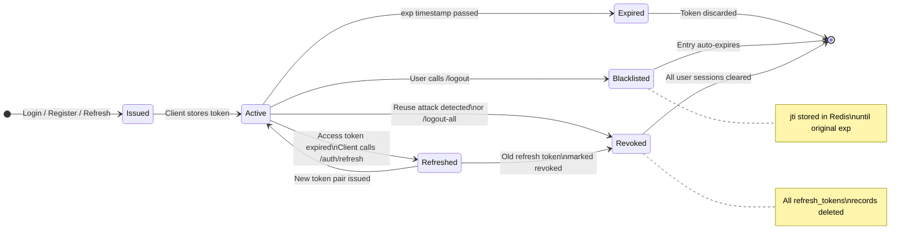

### 7.3 Access Token vs Refresh Token Comparison

| Property | Access Token | Refresh Token |
|----------|-------------|---------------|
| **Format** | JWT (signed) | Opaque random string |
| **Default TTL** | 15 minutes | 7 days |
| **Max Lifetime** | 60 minutes (configurable) | 30 days (configurable) |
| **Storage — Web** | Memory / HTTP-only cookie | HTTP-only, Secure, SameSite=Strict cookie |
| **Storage — Mobile** | Secure Keychain/Keystore | Secure Keychain/Keystore |
| **Transmitted Via** | Authorization: Bearer header | Request body to /auth/refresh |
| **Revocable** | Via JTI blacklist | Direct DB deletion |
| **Persisted in DB** | No (stateless) | Yes (hashed) |
| **Contains Claims** | Yes (roles, sub, etc.) | No |

---

## 8. API Endpoint Specification

### 8.1 Endpoint Summary

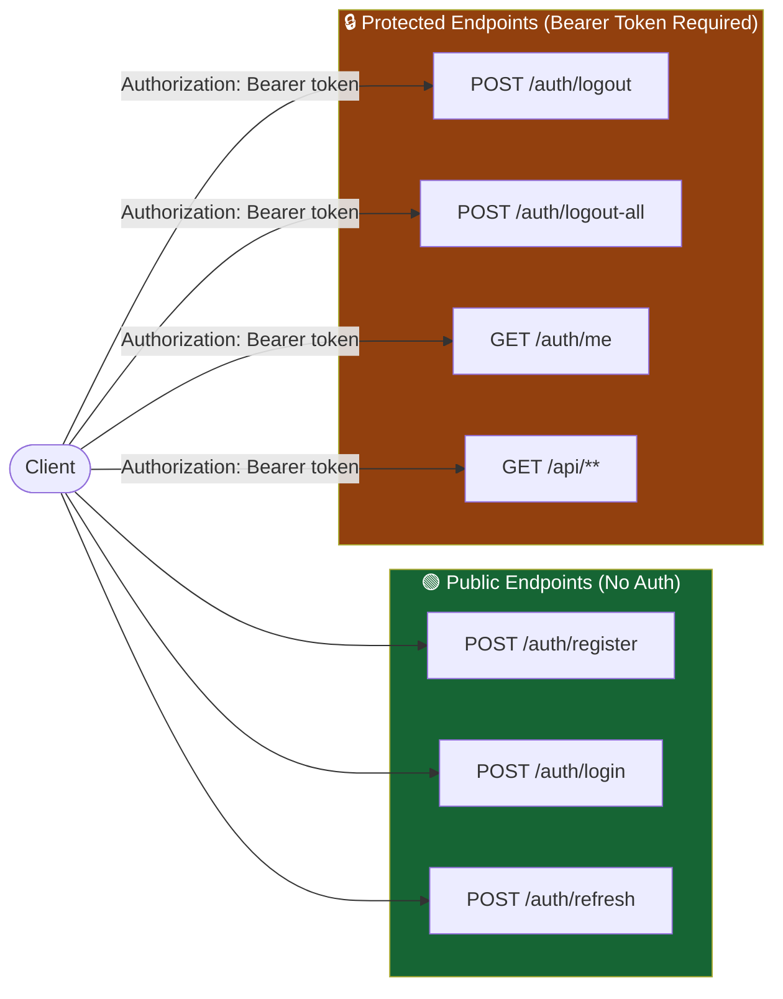

### 8.2 Endpoint Details

| Method | Endpoint | Auth | Request Body | Success Response | Error Codes |
|--------|----------|------|--------------|------------------|-------------|
| `POST` | `/auth/register` | None | `name, email, password` | 201 + token pair | 400, 409 |
| `POST` | `/auth/login` | None | `email, password` | 200 + token pair | 401, 423 |
| `POST` | `/auth/refresh` | Refresh Token | `refresh_token` | 200 + new token pair | 401 |
| `POST` | `/auth/logout` | Bearer Token | — | 204 No Content | 401 |
| `POST` | `/auth/logout-all` | Bearer Token | — | 204 No Content | 401 |
| `GET` | `/auth/me` | Bearer Token | — | 200 + user profile | 401 |

### 8.3 Standard Error Response Schema

```json
{
  "error": {
    "code": "TOKEN_EXPIRED",
    "message": "The provided token has expired.",
    "timestamp": "2025-06-01T12:00:00Z",
    "request_id": "uuid-v4"
  }
}
```

| Error Code | HTTP Status | Trigger |
|------------|-------------|---------|
| `TOKEN_MISSING` | 401 | No Authorization header |
| `TOKEN_INVALID` | 401 | Signature mismatch or malformed |
| `TOKEN_EXPIRED` | 401 | `exp` claim in the past |
| `TOKEN_REVOKED` | 401 | JTI found in blacklist |
| `REFRESH_TOKEN_INVALID` | 401 | Refresh token not found |
| `REFRESH_TOKEN_EXPIRED` | 401 | Refresh token past max lifetime |
| `REFRESH_TOKEN_REUSE_DETECTED` | 401 | Consumed token reused |
| `ACCOUNT_LOCKED` | 423 | Too many failed login attempts |
| `EMAIL_EXISTS` | 409 | Duplicate registration |
| `INVALID_CREDENTIALS` | 401 | Wrong password / unknown email |

---

## 9. Database Schema Changes

### 9.1 Entity Relationship Diagram

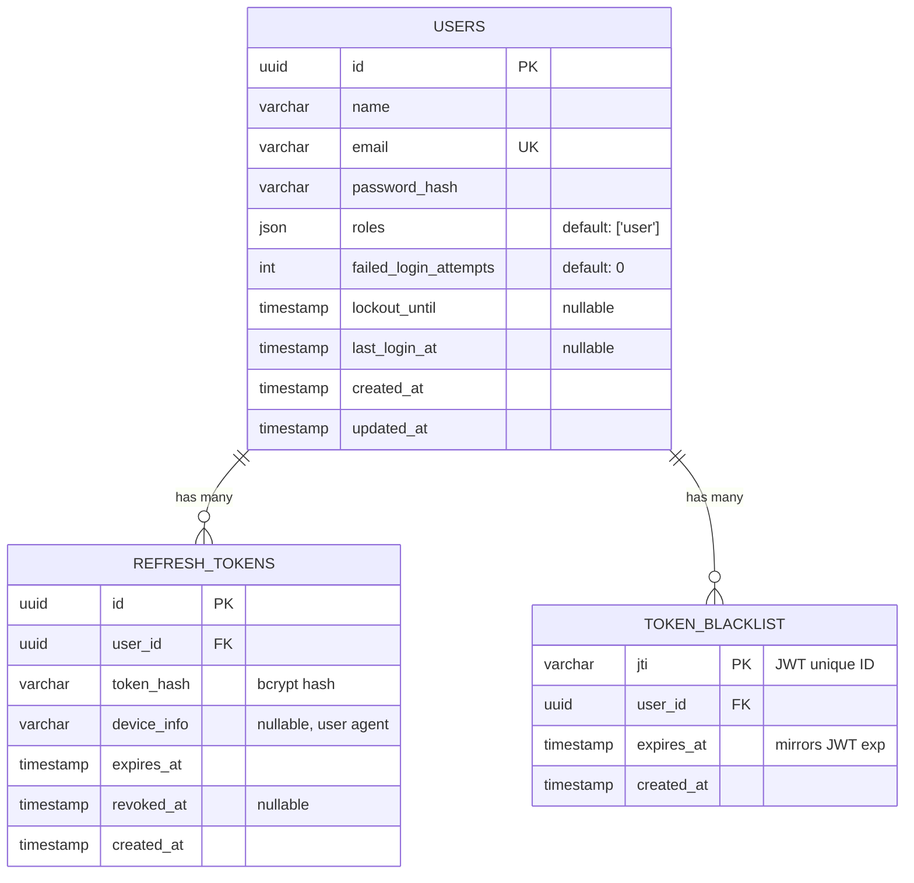

### 9.2 Migration Steps

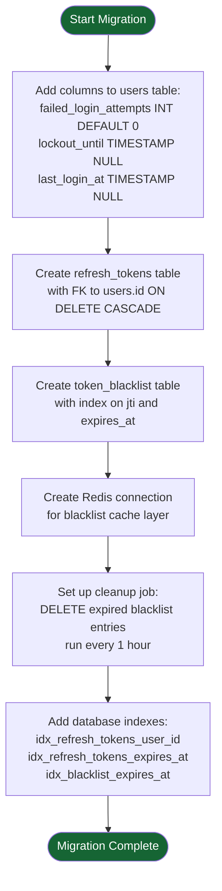

---

## 10. Non-Functional Requirements

| ID | Category | Requirement | Acceptance Criteria |
|----|----------|-------------|---------------------|
| NFR-PERF-001 | Performance | Token generation < 50ms at P95 | Load test confirms ≤ 50ms |
| NFR-PERF-002 | Performance | Middleware overhead < 10ms per request | APM measurements confirm |
| NFR-SEC-001 | Security | JWT secret minimum 256-bit (HS256) or 2048-bit RSA | Key audit passes |
| NFR-SEC-002 | Security | All auth events logged (timestamp, IP, user agent) | 100% event coverage |
| NFR-SEC-003 | Security | Tokens must NOT be stored in localStorage | Security code review pass |
| NFR-SCA-001 | Scalability | Token validation stateless — no DB call per route | Load test: 1000 RPS no DB hits |
| NFR-REL-001 | Reliability | Auth service 99.9% uptime SLA | Monthly uptime reports |
| NFR-MNT-001 | Maintainability | TTL, algorithm, secrets are environment-configurable | No hardcoded values in source |
| NFR-CMP-001 | Compliance | JWT payload must not contain passwords or full PII | Static analysis + code review |
| NFR-USB-001 | Usability | Auth errors return standardized JSON with error codes | API contract test suite passes |

---

## 11. Security Requirements

### 11.1 Security Controls

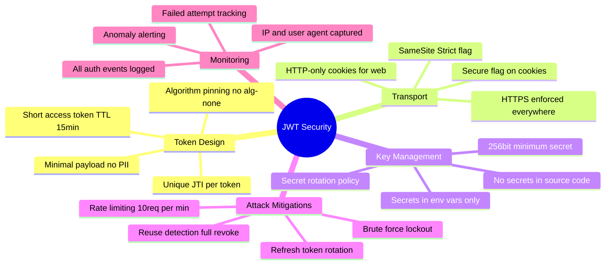

### 11.2 OWASP Compliance

| OWASP Top 10 | Control Implemented |
|--------------|---------------------|
| **A01 – Broken Access Control** | Role claims enforced server-side; client cannot elevate privileges |
| **A02 – Cryptographic Failures** | Secrets in env vars; industry-standard signing algorithms only |
| **A03 – Injection** | JWT parsed via vetted library only; no string concatenation in token handling |
| **A07 – Auth Failures** | Brute-force protection, secure token storage, complete revocation support |
| **A09 – Security Logging** | All auth events logged with IP, timestamp, user agent, and outcome |

### 11.3 Token Threat Model

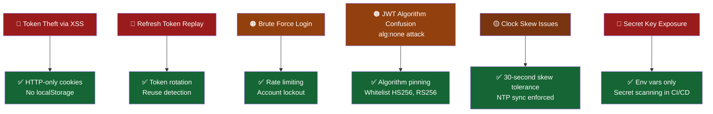

---

## 12. Implementation Plan

### 12.1 Sprint Roadmap

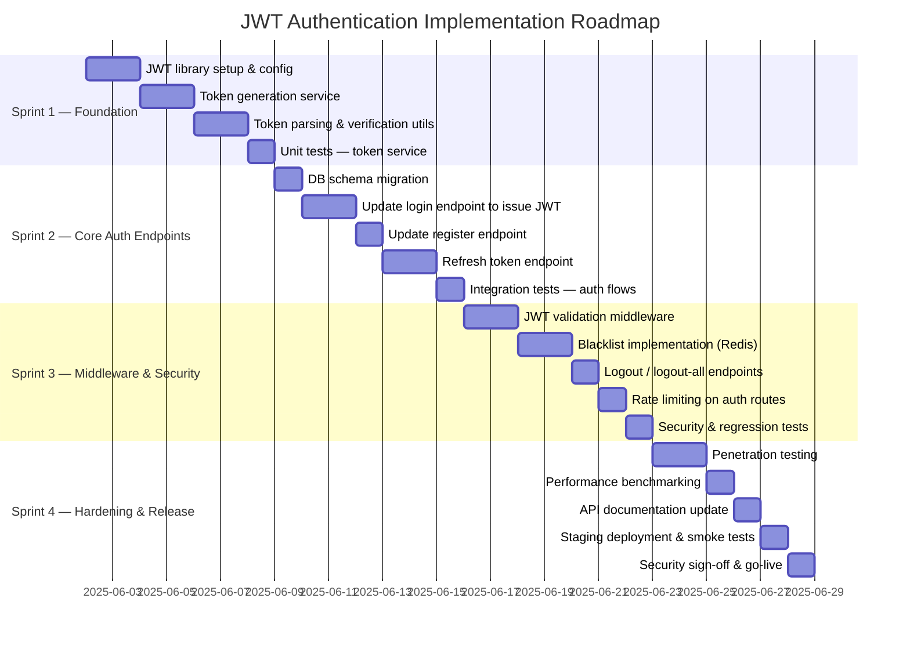

### 12.2 Deliverables by Sprint

| Sprint | Duration | Key Deliverables | Exit Criteria |
|--------|----------|-----------------|---------------|
| **Sprint 1** | Week 1 | JWT service, token generation/parsing, unit tests | Token generation returns valid, verifiable JWT |
| **Sprint 2** | Week 2 | Updated login/register endpoints, refresh endpoint, DB schema | Full login flow returns token pair; refresh rotates tokens |
| **Sprint 3** | Week 3 | Auth middleware, blacklist, logout, rate limiting | Protected routes reject invalid tokens; logout revokes |
| **Sprint 4** | Week 4 | Security testing, benchmarks, docs, staging deploy | All security tests pass; perf NFRs met; Security sign-off |

---

## 13. Migration Strategy

The existing login system must remain operational throughout the transition. The strategy follows four phases with zero forced downtime.

### 13.1 Migration Phases

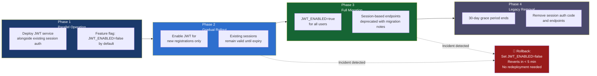

### 13.2 Client-Side Migration Guide

| Client Type | Access Token Storage | Refresh Token Storage | Migration Action |
|-------------|---------------------|----------------------|-----------------|
| Web (SPA) | In-memory (JS variable) | HTTP-only cookie | Remove localStorage token logic; implement in-memory store |
| Web (SSR) | HTTP-only cookie | HTTP-only cookie | Update cookie handling to include JWT |
| Mobile (iOS) | iOS Keychain | iOS Keychain | Store tokens in Keychain; update Authorization header logic |
| Mobile (Android) | Android Keystore | Android Keystore | Store tokens in EncryptedSharedPreferences |
| API Consumer | Environment variable | Refresh via API | Implement token refresh loop; handle TOKEN_EXPIRED response |

---

## 14. Testing Requirements

### 14.1 Test Strategy Overview

```mermaid
graph TD
    subgraph L1["Layer 1 — Unit Tests (Jest/Mocha)"]
        UT1[Token generation with correct claims]
        UT2[Token signature verification]
        UT3[Expiry calculation accuracy]
        UT4[Malformed input rejection]
        UT5[Blacklist add and lookup]
    end

    subgraph L2["Layer 2 — Integration Tests (Supertest)"]
        IT1[Full registration → login → access flow]
        IT2[Refresh token rotation end-to-end]
        IT3[Logout → token rejection]
        IT4[Protected route with valid/expired/revoked token]
        IT5[Account lockout after 5 failures]
    end

    subgraph L3["Layer 3 — Security Tests (OWASP ZAP / Burp Suite)"]
        ST1[Token tampering and signature forging]
        ST2[Algorithm confusion — alg:none attack]
        ST3[Refresh token replay attack]
        ST4[Brute force credential stuffing]
        ST5[JWT secret brute force test]
    end

    subgraph L4["Layer 4 — Performance Tests (k6)"]
        PT1[1000 concurrent token validations]
        PT2[Token generation throughput]
        PT3[Refresh storm under high load]
        PT4[Middleware latency under load]
    end

    subgraph L5["Layer 5 — Regression Tests (Cypress)"]
        RT1[Existing login UI flow unchanged]
        RT2[Registration flow unchanged]
        RT3[All existing E2E tests pass]
    end

    L1 --> L2 --> L3 --> L4 --> L5
```

### 14.2 Security Test Cases

| Test Case | Attack Simulated | Expected Result |
|-----------|-----------------|-----------------|
| Submit JWT with `alg: none` | Algorithm confusion | 401 TOKEN_INVALID |
| Modify payload and re-submit | Signature tampering | 401 TOKEN_INVALID |
| Replay a used refresh token | Refresh token replay | 401 + all sessions revoked |
| Submit expired access token | Token expiry | 401 TOKEN_EXPIRED |
| Submit blacklisted token | Revoked token use | 401 TOKEN_REVOKED |
| 100 rapid login attempts | Brute force | 423 ACCOUNT_LOCKED after 5 |
| Decode JWT and inject elevated role | Privilege escalation | Server-side role check rejects |

---

## 15. Risk Register

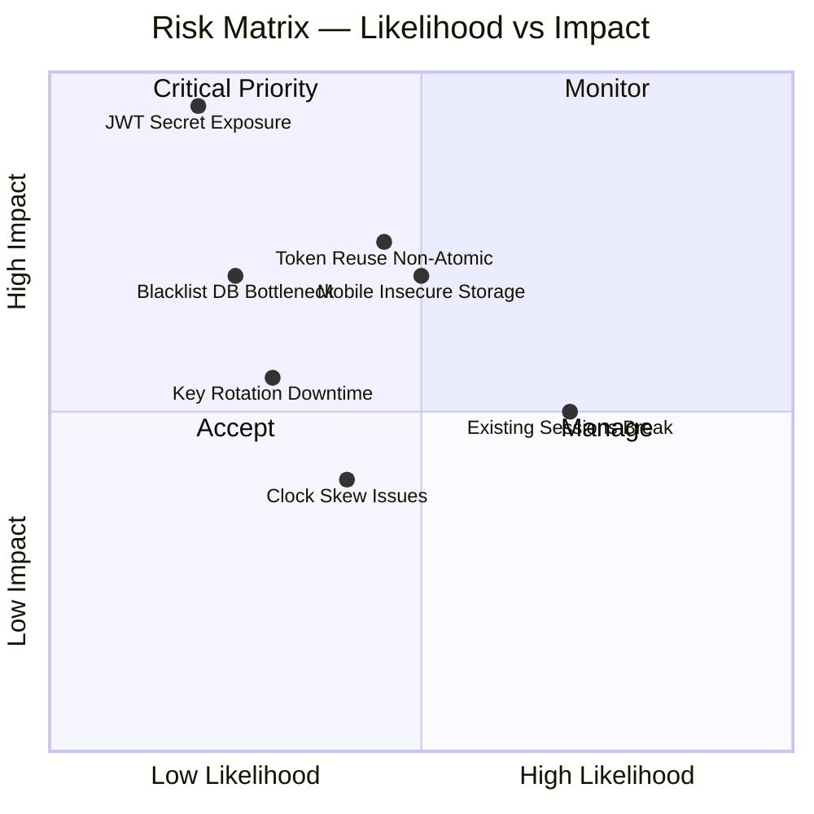

### 15.1 Risk Detail

| # | Risk | Likelihood | Impact | Mitigation | Owner |
|---|------|-----------|--------|-----------|-------|
| R-01 | JWT secret exposure in source code | Low | 🔴 Critical | Mandatory env var usage; secret scanning in CI/CD; rotation policy | Security Lead |
| R-02 | Non-atomic refresh token rotation | Medium | 🔴 High | DB transactions ensure atomicity; integration tests cover edge cases | Backend Dev |
| R-03 | Existing sessions broken during migration | High | 🟠 Medium | Feature flag parallel run; rollback plan documented and tested | Tech Lead |
| R-04 | Mobile clients store tokens insecurely | Medium | 🔴 High | Platform SDK guidelines; Keychain/Keystore documentation | Mobile Dev |
| R-05 | Blacklist DB becomes performance bottleneck | Low | 🔴 High | Redis for in-memory blacklist with TTL; DB as fallback only | Architect |
| R-06 | Clock skew causing premature token expiry | Medium | 🟠 Medium | 30-second tolerance in validation; NTP sync enforced on servers | DevOps |
| R-07 | Secret rotation causing active token rejection | Low | 🟠 Medium | Grace period with old + new secret accepted during transition | Security Lead |

---

## 16. Stakeholders & Approval

### 16.1 RACI Matrix

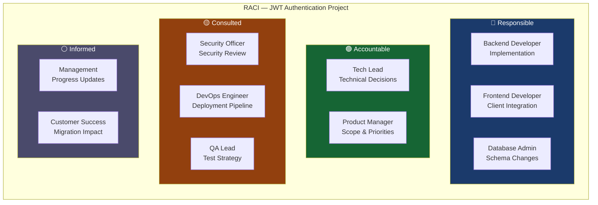

### 16.2 Approval Sign-Off

| Role | Name | Signature | Date | Status |
|------|------|-----------|------|--------|
| Product Manager | | | | ⏳ Pending |
| Engineering Lead | | | | ⏳ Pending |
| Security Officer | | | | ⏳ Pending |
| QA Lead | | | | ⏳ Pending |
| DevOps Engineer | | | | ⏳ Pending |
| Database Admin | | | | ⏳ Pending |

---

## 17. Glossary & References

### 17.1 Glossary

| Term | Definition |
|------|-----------|
| **JWT** | JSON Web Token — compact, URL-safe token format for securely transmitting claims (RFC 7519) |
| **Access Token** | Short-lived JWT (default 15 min) used to authorize API requests |
| **Refresh Token** | Longer-lived opaque token used to obtain new access tokens without re-authentication |
| **JTI** | JWT ID — unique identifier claim enabling precise token tracking and revocation |
| **Bearer Token** | Authorization scheme where the bearer of a token is granted resource access |
| **Token Rotation** | Issuing a new refresh token on each use; old refresh token immediately invalidated |
| **Blacklist** | Store of revoked JWT IDs (jti) rejected even before natural expiry |
| **Claims** | Key-value statements about the user encoded in the JWT payload |
| **HS256** | HMAC-SHA256 — symmetric signing algorithm using a shared secret |
| **RS256** | RSA-SHA256 — asymmetric algorithm using public/private key pair |
| **TTL** | Time to Live — duration a token remains valid from issuance |
| **OWASP** | Open Web Application Security Project — community providing web security standards |
| **Stateless Auth** | Authentication where the server holds no session state; all context is in the token |
| **SameSite=Strict** | Cookie attribute preventing cross-site request forgery (CSRF) |
| **jti Blacklist** | List of revoked JWT unique IDs stored in Redis/DB to block specific tokens |

### 17.2 References

| # | Reference | URL / Source |
|---|-----------|-------------|
| 1 | RFC 7519 — JSON Web Token (JWT) | https://tools.ietf.org/html/rfc7519 |
| 2 | RFC 6750 — OAuth 2.0 Bearer Token Usage | https://tools.ietf.org/html/rfc6750 |
| 3 | OWASP Authentication Cheat Sheet | https://cheatsheetseries.owasp.org/cheatsheets/Authentication_Cheat_Sheet.html |
| 4 | OWASP JWT Security Cheat Sheet | https://cheatsheetseries.owasp.org/cheatsheets/JSON_Web_Token_for_Java_Cheat_Sheet.html |
| 5 | jsonwebtoken npm library | https://github.com/auth0/node-jsonwebtoken |
| 6 | NIST SP 800-63B — Digital Identity Guidelines | https://pages.nist.gov/800-63-3/sp800-63b.html |
| 7 | OWASP Top 10 — 2021 | https://owasp.org/www-project-top-ten/ |

---

> **Document Control:** This document is version-controlled. Any changes require a version increment and re-approval by all listed stakeholders.
> **Next Review Date:** 30 days post go-live or upon any significant scope change.
