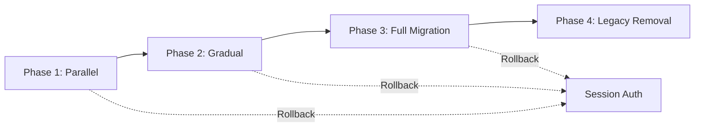

# JWT Authentication Migration Guide

**Document Version**: 1.0  
**Last Updated**: 2025-01-10  
**Status**: Ready for Implementation

---

## Table of Contents

1. [Overview](#overview)
2. [Migration Strategy](#migration-strategy)
3. [Phase 1: Parallel Operation](#phase-1-parallel-operation)
4. [Phase 2: Gradual Rollout](#phase-2-gradual-rollout)
5. [Phase 3: Full Migration](#phase-3-full-migration)
6. [Phase 4: Legacy Removal](#phase-4-legacy-removal)
7. [Configuration Changes](#configuration-changes)
8. [Frontend Changes](#frontend-changes)
9. [Rollback Procedure](#rollback-procedure)
10. [Testing and Validation](#testing-and-validation)
11. [Troubleshooting](#troubleshooting)

---

## Overview

This guide provides step-by-step instructions for migrating from the existing session-based authentication system to the new JWT-based authentication system in the AI-Powered Travel Management System (APTMS).

### Migration Goals

- **Zero Downtime**: Maintain service availability throughout migration
- **Backward Compatibility**: Existing sessions continue working during transition
- **Gradual Rollout**: Controlled migration with ability to rollback
- **Data Integrity**: No loss of user data or active sessions

### Timeline

- **Phase 1**: 1 week (Parallel operation and monitoring)
- **Phase 2**: 2 weeks (Gradual rollout to user segments)
- **Phase 3**: 1 week (Full migration and monitoring)
- **Phase 4**: 1 week (Legacy code removal)

**Total Duration**: 5 weeks

---

## Migration Strategy

The migration follows a **4-phase approach** with feature flags controlling the rollout:



### Feature Flag Control

The migration is controlled by the `JWT_ENABLED` environment variable:

- `JWT_ENABLED=false` (default): Session-based auth only
- `JWT_ENABLED=true`: JWT auth enabled

---

## Phase 1: Parallel Operation

**Duration**: 1 week  
**Goal**: Deploy JWT system alongside existing session auth with no user impact

### 1.1 Pre-Deployment Checklist

- [ ] Database schema changes applied (refresh_tokens, token_blacklist tables)
- [ ] Redis instance configured and tested
- [ ] JWT secret generated (minimum 256 bits)
- [ ] Environment variables configured
- [ ] All unit and integration tests passing
- [ ] Security audit completed
- [ ] Monitoring and alerting configured

### 1.2 Database Migration

Run the following SQL scripts in order:

```sql
-- 1. Add new columns to users table
ALTER TABLE users 
  ADD COLUMN failed_login_attempts INT DEFAULT 0 NOT NULL,
  ADD COLUMN lockout_until TIMESTAMP NULL,
  ADD COLUMN last_login_at TIMESTAMP NULL;

-- 2. Create indexes
CREATE INDEX idx_users_lockout ON users(lockout_until) 
  WHERE lockout_until IS NOT NULL;
CREATE INDEX idx_users_email ON users(email);

-- 3. Create refresh_tokens table
CREATE TABLE refresh_tokens (
  id BINARY(16) PRIMARY KEY,
  user_id BINARY(16) NOT NULL,
  token_hash VARCHAR(255) NOT NULL,
  device_info VARCHAR(255),
  ip_address VARCHAR(45),
  user_agent TEXT,
  expires_at TIMESTAMP NOT NULL,
  revoked_at TIMESTAMP NULL,
  created_at TIMESTAMP DEFAULT CURRENT_TIMESTAMP NOT NULL,
  updated_at TIMESTAMP DEFAULT CURRENT_TIMESTAMP ON UPDATE CURRENT_TIMESTAMP NOT NULL,
  
  CONSTRAINT fk_refresh_tokens_user 
    FOREIGN KEY (user_id) REFERENCES users(id) ON DELETE CASCADE,
  
  INDEX idx_refresh_tokens_user_id (user_id),
  INDEX idx_refresh_tokens_expires_at (expires_at)
) ENGINE=InnoDB DEFAULT CHARSET=utf8mb4 COLLATE=utf8mb4_unicode_ci;

-- 4. Create token_blacklist table
CREATE TABLE token_blacklist (
  jti VARCHAR(36) PRIMARY KEY,
  user_id BINARY(16) NOT NULL,
  reason VARCHAR(50) NOT NULL,
  expires_at TIMESTAMP NOT NULL,
  created_at TIMESTAMP DEFAULT CURRENT_TIMESTAMP NOT NULL,
  
  CONSTRAINT fk_blacklist_user 
    FOREIGN KEY (user_id) REFERENCES users(id) ON DELETE CASCADE,
  
  INDEX idx_blacklist_expires_at (expires_at),
  INDEX idx_blacklist_user_id (user_id)
) ENGINE=InnoDB DEFAULT CHARSET=utf8mb4 COLLATE=utf8mb4_unicode_ci;
```

### 1.3 Deployment Steps

1. **Deploy Backend with JWT_ENABLED=false**
   ```bash
   # Set environment variables
   export JWT_ENABLED=false
   export JWT_SECRET="your-256-bit-secret-here"
   export JWT_ACCESS_TOKEN_TTL=900000  # 15 minutes
   export JWT_REFRESH_TOKEN_TTL=604800000  # 7 days
   
   # Deploy application
   mvn clean package
   java -jar target/System-0.0.1-SNAPSHOT.jar
   ```

2. **Verify Deployment**
   - Check application logs for startup errors
   - Verify database connections
   - Test existing session-based login
   - Confirm JWT endpoints are available but not used

3. **Monitor for 24 Hours**
   - Watch error rates
   - Monitor database performance
   - Check Redis connectivity
   - Verify no regression in existing functionality

### 1.4 Success Criteria

- ✅ Application starts without errors
- ✅ Existing session-based auth works normally
- ✅ JWT endpoints respond (but not used by clients)
- ✅ No increase in error rates
- ✅ Database migrations successful

---

## Phase 2: Gradual Rollout

**Duration**: 2 weeks  
**Goal**: Enable JWT for subset of users and monitor

### 2.1 Enable JWT for New Registrations

**Week 1**: New users only

1. **Update Frontend Configuration**
   ```typescript
   // environment.ts
   export const environment = {
     useJwtAuth: true,  // Enable JWT for new registrations
     apiUrl: 'http://localhost:8080/api'
   };
   ```

2. **Deploy Frontend Changes**
   - Update registration flow to use `/api/auth/register`
   - Store tokens in sessionStorage (refresh) and memory (access)
   - Implement HTTP interceptor for Bearer token

3. **Monitor New User Registrations**
   - Track JWT token generation success rate
   - Monitor token validation performance
   - Watch for authentication errors

### 2.2 Enable JWT for Existing Users (Opt-In)

**Week 2**: Existing users can opt-in

1. **Add Migration Endpoint** (Optional)
   ```java
   @PostMapping("/migrate-to-jwt")
   public ResponseEntity<AuthResponse> migrateToJwt() {
       // Migrate existing session to JWT
       // Return new JWT tokens
   }
   ```

2. **Gradual User Migration**
   - Send email to 10% of users inviting them to try new auth
   - Monitor adoption rate and error rates
   - Increase to 25%, 50%, 75% based on success

### 2.3 Success Criteria

- ✅ New registrations use JWT successfully
- ✅ Token refresh works correctly
- ✅ No increase in authentication failures
- ✅ Performance metrics within targets (< 50ms token generation)
- ✅ Positive user feedback

---

## Phase 3: Full Migration

**Duration**: 1 week  
**Goal**: Enable JWT for all users

### 3.1 Enable JWT Globally

1. **Set Feature Flag**
   ```bash
   export JWT_ENABLED=true
   ```

2. **Deploy Backend**
   ```bash
   mvn clean package
   java -jar target/System-0.0.1-SNAPSHOT.jar
   ```

3. **Deploy Frontend**
   - Update all authentication flows to use JWT endpoints
   - Remove session-based auth code (keep for rollback)

### 3.2 Session Migration

**Option A: Force Re-Login** (Recommended)
- Invalidate all existing sessions
- Users must log in again with JWT
- Clear communication to users

**Option B: Automatic Migration**
- Convert active sessions to JWT on next request
- More complex, higher risk

### 3.3 Monitoring

Monitor these metrics closely for 7 days:

| Metric | Target | Alert Threshold |
|--------|--------|-----------------|
| Authentication success rate | > 99.9% | < 99% |
| Token generation latency (P95) | < 50ms | > 100ms |
| Token validation latency (P95) | < 10ms | > 20ms |
| Error rate | < 0.1% | > 1% |
| User complaints | 0 | > 5 |

### 3.4 Success Criteria

- ✅ All users successfully using JWT
- ✅ No critical issues reported
- ✅ Performance metrics within targets
- ✅ Security audit passed
- ✅ Rollback plan tested and ready

---

## Phase 4: Legacy Removal

**Duration**: 1 week  
**Goal**: Remove session-based authentication code

### 4.1 Code Cleanup

1. **Remove Legacy Endpoints**
   ```java
   // Remove these deprecated endpoints
   @Deprecated
   @PostMapping("/user/register")
   @PostMapping("/user/login")
   ```

2. **Remove Session Configuration**
   - Remove session management from Spring Security config
   - Remove session-related dependencies

3. **Update Documentation**
   - Remove references to session-based auth
   - Update API documentation
   - Update developer guides

### 4.2 Database Cleanup

```sql
-- Remove session-related tables (if any)
DROP TABLE IF EXISTS spring_session;
DROP TABLE IF EXISTS spring_session_attributes;
```

### 4.3 Success Criteria

- ✅ Legacy code removed
- ✅ All tests passing
- ✅ Documentation updated
- ✅ No references to session auth remain

---

## Configuration Changes

### Backend Configuration

**Required Environment Variables**:

```bash
# JWT Configuration
JWT_SECRET=your-256-bit-secret-minimum-32-characters-long
JWT_ACCESS_TOKEN_TTL=900000          # 15 minutes in milliseconds
JWT_REFRESH_TOKEN_TTL=604800000      # 7 days in milliseconds
JWT_ISSUER=com.aptms.auth
JWT_AUDIENCE=com.aptms.api
JWT_ALGORITHM=HS256

# Feature Flag
JWT_ENABLED=true

# Redis Configuration
REDIS_HOST=localhost
REDIS_PORT=6379
REDIS_PASSWORD=your-redis-password
REDIS_TIMEOUT=2000

# Database Configuration
DB_URL=jdbc:mysql://localhost:3306/travel_db
DB_USERNAME=root
DB_PASSWORD=your-db-password

# Security Configuration
MAX_FAILED_ATTEMPTS=5
LOCKOUT_DURATION_MINUTES=15
PASSWORD_MIN_LENGTH=8
```

**application.properties Updates**:

```properties
# JWT Configuration
app.security.jwt.secret=${JWT_SECRET}
app.security.jwt.access-token-ttl=${JWT_ACCESS_TOKEN_TTL:900000}
app.security.jwt.refresh-token-ttl=${JWT_REFRESH_TOKEN_TTL:604800000}
app.security.jwt.issuer=${JWT_ISSUER:com.aptms.auth}
app.security.jwt.audience=${JWT_AUDIENCE:com.aptms.api}

# Redis Configuration
spring.data.redis.host=${REDIS_HOST:localhost}
spring.data.redis.port=${REDIS_PORT:6379}
spring.data.redis.password=${REDIS_PASSWORD:}

# OpenAPI/Swagger
springdoc.api-docs.path=/api-docs
springdoc.swagger-ui.path=/swagger-ui.html
```

---

## Frontend Changes

### Angular Service Updates

**1. Update AuthService**

```typescript
// src/app/services/auth.service.ts
import { Injectable } from '@angular/core';
import { HttpClient } from '@angular/common/http';
import { Observable, BehaviorSubject } from 'rxjs';
import { tap } from 'rxjs/operators';

@Injectable({ providedIn: 'root' })
export class AuthService {
  private readonly API_URL = 'http://localhost:8080/api/auth';
  private currentUserSubject = new BehaviorSubject<User | null>(null);
  
  constructor(
    private http: HttpClient,
    private tokenStorage: TokenStorageService
  ) {}
  
  register(request: RegisterRequest): Observable<AuthResponse> {
    return this.http.post<AuthResponse>(`${this.API_URL}/register`, request)
      .pipe(tap(response => this.handleAuthResponse(response)));
  }
  
  login(request: LoginRequest): Observable<AuthResponse> {
    return this.http.post<AuthResponse>(`${this.API_URL}/login`, request)
      .pipe(tap(response => this.handleAuthResponse(response)));
  }
  
  refreshToken(): Observable<AuthResponse> {
    const refreshToken = this.tokenStorage.getRefreshToken();
    return this.http.post<AuthResponse>(`${this.API_URL}/refresh`, { refreshToken })
      .pipe(tap(response => this.handleAuthResponse(response)));
  }
  
  logout(): Observable<void> {
    return this.http.post<void>(`${this.API_URL}/logout`, {})
      .pipe(tap(() => this.handleLogout()));
  }
  
  private handleAuthResponse(response: AuthResponse): void {
    this.tokenStorage.setTokens(response.accessToken, response.refreshToken);
    this.currentUserSubject.next(response.user);
  }
  
  private handleLogout(): void {
    this.tokenStorage.clearTokens();
    this.currentUserSubject.next(null);
  }
}
```

**2. Create TokenStorageService**

```typescript
// src/app/services/token-storage.service.ts
import { Injectable } from '@angular/core';

@Injectable({ providedIn: 'root' })
export class TokenStorageService {
  private accessToken: string | null = null;
  private readonly REFRESH_TOKEN_KEY = 'refresh_token';
  
  setTokens(accessToken: string, refreshToken: string): void {
    this.accessToken = accessToken;
    sessionStorage.setItem(this.REFRESH_TOKEN_KEY, refreshToken);
  }
  
  getAccessToken(): string | null {
    return this.accessToken;
  }
  
  getRefreshToken(): string | null {
    return sessionStorage.getItem(this.REFRESH_TOKEN_KEY);
  }
  
  clearTokens(): void {
    this.accessToken = null;
    sessionStorage.removeItem(this.REFRESH_TOKEN_KEY);
  }
}
```

**3. Create JWT Interceptor**

```typescript
// src/app/interceptors/jwt.interceptor.ts
import { Injectable } from '@angular/core';
import { HttpInterceptor, HttpRequest, HttpHandler, HttpEvent, HttpErrorResponse } from '@angular/common/http';
import { Observable, throwError, BehaviorSubject } from 'rxjs';
import { catchError, filter, take, switchMap } from 'rxjs/operators';
import { AuthService } from '../services/auth.service';
import { TokenStorageService } from '../services/token-storage.service';

@Injectable()
export class JwtInterceptor implements HttpInterceptor {
  private isRefreshing = false;
  private refreshTokenSubject: BehaviorSubject<string | null> = new BehaviorSubject<string | null>(null);
  
  constructor(
    private authService: AuthService,
    private tokenStorage: TokenStorageService
  ) {}
  
  intercept(req: HttpRequest<any>, next: HttpHandler): Observable<HttpEvent<any>> {
    // Skip auth endpoints
    if (req.url.includes('/auth/login') || req.url.includes('/auth/register')) {
      return next.handle(req);
    }
    
    // Add token to request
    const token = this.tokenStorage.getAccessToken();
    if (token) {
      req = this.addToken(req, token);
    }
    
    return next.handle(req).pipe(
      catchError(error => {
        if (error instanceof HttpErrorResponse && error.status === 401) {
          return this.handle401Error(req, next);
        }
        return throwError(() => error);
      })
    );
  }
  
  private addToken(req: HttpRequest<any>, token: string): HttpRequest<any> {
    return req.clone({
      setHeaders: { Authorization: `Bearer ${token}` }
    });
  }
  
  private handle401Error(req: HttpRequest<any>, next: HttpHandler): Observable<HttpEvent<any>> {
    if (!this.isRefreshing) {
      this.isRefreshing = true;
      this.refreshTokenSubject.next(null);
      
      return this.authService.refreshToken().pipe(
        switchMap((response: AuthResponse) => {
          this.isRefreshing = false;
          this.refreshTokenSubject.next(response.accessToken);
          return next.handle(this.addToken(req, response.accessToken));
        }),
        catchError(err => {
          this.isRefreshing = false;
          this.authService.logout();
          return throwError(() => err);
        })
      );
    } else {
      return this.refreshTokenSubject.pipe(
        filter(token => token != null),
        take(1),
        switchMap(token => next.handle(this.addToken(req, token!)))
      );
    }
  }
}
```

**4. Register Interceptor**

```typescript
// src/app/app.config.ts
import { HTTP_INTERCEPTORS } from '@angular/common/http';
import { JwtInterceptor } from './interceptors/jwt.interceptor';

export const appConfig: ApplicationConfig = {
  providers: [
    {
      provide: HTTP_INTERCEPTORS,
      useClass: JwtInterceptor,
      multi: true
    }
  ]
};
```

---

## Rollback Procedure

### When to Rollback

Rollback if any of these conditions occur:

- Authentication success rate drops below 99%
- Critical security vulnerability discovered
- Database corruption or data loss
- Performance degradation > 50%
- More than 10 user complaints in 1 hour

### Rollback Steps

**1. Disable JWT (< 5 minutes)**

```bash
# Set feature flag
export JWT_ENABLED=false

# Restart application
systemctl restart aptms-backend
```

**2. Revert Frontend (< 10 minutes)**

```bash
# Deploy previous frontend version
git checkout <previous-release-tag>
npm run build
npm run deploy
```

**3. Verify Rollback**

- [ ] Session-based auth working
- [ ] Users can log in successfully
- [ ] No authentication errors
- [ ] Performance back to normal

**4. Post-Rollback Actions**

- Investigate root cause
- Fix issues in staging environment
- Re-test thoroughly
- Plan new migration attempt

### Rollback Testing

Test rollback procedure in staging environment:

```bash
# 1. Enable JWT
export JWT_ENABLED=true
./deploy.sh

# 2. Verify JWT working
curl -X POST http://localhost:8080/api/auth/login \
  -H "Content-Type: application/json" \
  -d '{"email":"test@example.com","password":"password"}'

# 3. Disable JWT (rollback)
export JWT_ENABLED=false
./deploy.sh

# 4. Verify session auth working
curl -X POST http://localhost:8080/api/user/login \
  -H "Content-Type: application/json" \
  -d '{"email":"test@example.com","password":"password"}'
```

---

## Testing and Validation

### Pre-Migration Testing

**1. Unit Tests**
```bash
mvn test
```

**2. Integration Tests**
```bash
mvn verify
```

**3. Security Tests**
- Token tampering tests
- Signature verification tests
- Refresh token reuse detection
- Account lockout tests

**4. Performance Tests**
```bash
# Load test with k6
k6 run load-tests/jwt-auth.js
```

### Post-Migration Validation

**1. Smoke Tests**

```bash
# Register new user
curl -X POST http://localhost:8080/api/auth/register \
  -H "Content-Type: application/json" \
  -d '{
    "username": "testuser",
    "email": "test@example.com",
    "password": "SecurePass123!",
    "role": "USER"
  }'

# Login
curl -X POST http://localhost:8080/api/auth/login \
  -H "Content-Type: application/json" \
  -d '{
    "email": "test@example.com",
    "password": "SecurePass123!"
  }'

# Access protected endpoint
curl -X GET http://localhost:8080/api/auth/me \
  -H "Authorization: Bearer <access_token>"

# Refresh token
curl -X POST http://localhost:8080/api/auth/refresh \
  -H "Content-Type: application/json" \
  -d '{"refreshToken": "<refresh_token>"}'

# Logout
curl -X POST http://localhost:8080/api/auth/logout \
  -H "Authorization: Bearer <access_token>"
```

**2. Monitoring Checks**

- [ ] Authentication success rate > 99.9%
- [ ] Token generation latency < 50ms (P95)
- [ ] Token validation latency < 10ms (P95)
- [ ] No increase in error rates
- [ ] Redis cache hit rate > 95%

---

## Troubleshooting

### Common Issues

#### Issue 1: "TOKEN_INVALID" errors

**Symptoms**: Users getting TOKEN_INVALID errors on valid tokens

**Possible Causes**:
- JWT secret mismatch between instances
- Clock skew between servers
- Token signature algorithm mismatch

**Solutions**:
```bash
# 1. Verify JWT secret is consistent
echo $JWT_SECRET

# 2. Check server time synchronization
ntpdate -q pool.ntp.org

# 3. Verify algorithm configuration
grep JWT_ALGORITHM application.properties
```

#### Issue 2: Refresh token reuse false positives

**Symptoms**: Users getting logged out unexpectedly

**Possible Causes**:
- Race condition in token rotation
- Network retry causing duplicate requests
- Client-side token storage issue

**Solutions**:
```java
// Add idempotency key to refresh requests
@PostMapping("/refresh")
public ResponseEntity<AuthResponse> refresh(
    @RequestHeader("Idempotency-Key") String idempotencyKey,
    @Valid @RequestBody RefreshTokenRequest request) {
    // Check if request already processed
    // ...
}
```

#### Issue 3: High Redis latency

**Symptoms**: Slow authentication, timeouts

**Possible Causes**:
- Redis connection pool exhausted
- Network latency to Redis
- Redis memory pressure

**Solutions**:
```properties
# Increase connection pool size
spring.data.redis.jedis.pool.max-active=20
spring.data.redis.jedis.pool.max-idle=10

# Add connection timeout
spring.data.redis.timeout=5000

# Enable Redis persistence
# redis.conf: save 900 1
```

#### Issue 4: Database migration failures

**Symptoms**: Application won't start, schema errors

**Possible Causes**:
- Existing data conflicts
- Foreign key constraints
- Insufficient permissions

**Solutions**:
```sql
-- Check for conflicts
SELECT * FROM users WHERE id IS NULL;

-- Verify foreign keys
SHOW CREATE TABLE refresh_tokens;

-- Grant permissions
GRANT ALL PRIVILEGES ON travel_db.* TO 'aptms_user'@'%';
FLUSH PRIVILEGES;
```

### Support Contacts

- **Technical Lead**: tech-lead@aptms.com
- **DevOps Team**: devops@aptms.com
- **Security Team**: security@aptms.com
- **On-Call**: +1-555-0100

---

## Appendix

### A. Environment Variable Reference

| Variable | Description | Default | Required |
|----------|-------------|---------|----------|
| JWT_SECRET | JWT signing secret (min 256 bits) | - | Yes |
| JWT_ACCESS_TOKEN_TTL | Access token TTL (ms) | 900000 | No |
| JWT_REFRESH_TOKEN_TTL | Refresh token TTL (ms) | 604800000 | No |
| JWT_ISSUER | Token issuer | com.aptms.auth | No |
| JWT_AUDIENCE | Token audience | com.aptms.api | No |
| JWT_ENABLED | Feature flag | false | Yes |
| REDIS_HOST | Redis host | localhost | Yes |
| REDIS_PORT | Redis port | 6379 | No |
| REDIS_PASSWORD | Redis password | - | No |

### B. API Endpoint Reference

| Endpoint | Method | Auth Required | Description |
|----------|--------|---------------|-------------|
| /api/auth/register | POST | No | Register new user |
| /api/auth/login | POST | No | Login user |
| /api/auth/refresh | POST | No | Refresh tokens |
| /api/auth/logout | POST | Yes | Logout (single session) |
| /api/auth/logout-all | POST | Yes | Logout (all sessions) |
| /api/auth/me | GET | Yes | Get current user |

### C. Error Code Reference

| Error Code | HTTP Status | Description | Action |
|------------|-------------|-------------|--------|
| TOKEN_MISSING | 401 | Missing Authorization header | Add Bearer token |
| TOKEN_INVALID | 401 | Invalid signature or malformed JWT | Check token format |
| TOKEN_EXPIRED | 401 | Token has expired | Refresh token |
| TOKEN_REVOKED | 401 | Token is blacklisted | Re-authenticate |
| REFRESH_TOKEN_REUSE_DETECTED | 401 | Refresh token reused | Re-authenticate |
| INVALID_CREDENTIALS | 401 | Wrong email/password | Check credentials |
| ACCOUNT_LOCKED | 423 | Too many failed attempts | Wait 15 minutes |

---

**Document End**

For questions or issues, contact the APTMS Development Team at dev-team@aptms.com
