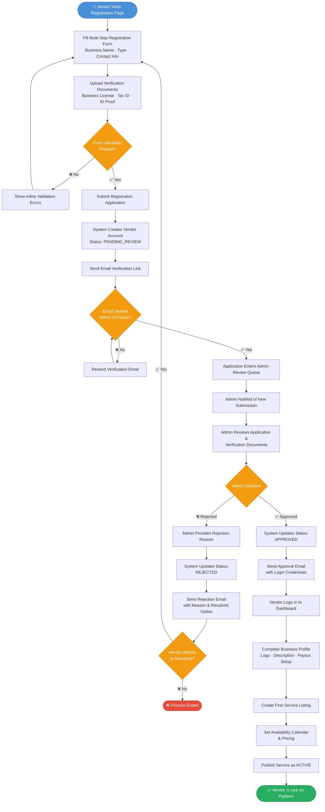
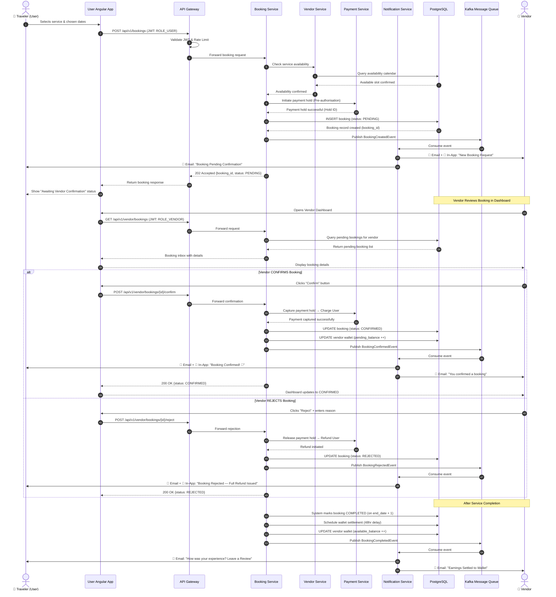
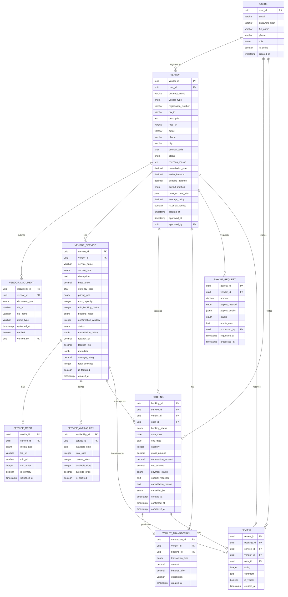

# Business Requirements Document (BRD)
## AI-Powered Traveling Management System (AITMS)
### Vendor Dashboard Module

---

| Field            | Details                                      |
|------------------|----------------------------------------------|
| **Document ID**  | AITMS-BRD-VND-001                            |
| **Version**      | 1.0.0                                        |
| **Status**       | Draft — Pending Stakeholder Review           |
| **Prepared By**  | Senior Business Analyst & Systems Architect  |
| **Tech Stack**   | Java Spring Boot (Backend) · Angular (Frontend) |
| **Date**         | 2026-05-11                                   |

---

## Table of Contents

1. [Executive Summary](#1-executive-summary)
2. [Project Scope & Objectives](#2-project-scope--objectives)
3. [Stakeholders & User Roles](#3-stakeholders--user-roles)
4. [Functional Requirements](#4-functional-requirements)
   - 4.1 [Vendor Registration & Onboarding](#41-vendor-registration--onboarding)
   - 4.2 [Service Management](#42-service-management)
   - 4.3 [Booking Control](#43-booking-control)
   - 4.4 [Earnings & Wallet](#44-earnings--wallet)
   - 4.5 [Analytics & Reporting](#45-analytics--reporting)
5. [Non-Functional Requirements](#5-non-functional-requirements)
6. [Data Attributes & Schema](#6-data-attributes--schema)
7. [Technical Constraints & Architecture](#7-technical-constraints--architecture)
8. [Process Diagrams](#8-process-diagrams)
   - 8.1 [Vendor Onboarding Flowchart](#81-vendor-onboarding-flowchart)
   - 8.2 [Booking Sequence Diagram](#82-booking-sequence-diagram)
   - 8.3 [Entity Relationship Diagram (ERD)](#83-entity-relationship-diagram-erd)
9. [Assumptions & Dependencies](#9-assumptions--dependencies)
10. [Acceptance Criteria](#10-acceptance-criteria)
11. [Glossary](#11-glossary)

---

## 1. Executive Summary

The **AI-Powered Traveling Management System (AITMS)** is a next-generation travel platform that leverages artificial intelligence to deliver personalized, seamless, and intelligent travel experiences. At the heart of this ecosystem lies the **Vendor Dashboard Module** — a mission-critical component that serves as the operational backbone for all third-party service providers on the platform.

### Strategic Importance

Travel platforms derive their competitive advantage not from technology alone, but from the **richness and reliability of their service inventory**. Without a robust vendor layer, the platform cannot offer hotels, transportation, or guided experiences to its end users. The Vendor Dashboard addresses this directly by providing:

- **A self-service portal** for vendors (Hotels, Tour Guides, Transport Operators) to register, list, and manage their offerings without manual platform intervention.
- **Real-time booking orchestration** ensuring that availability, confirmations, and cancellations are handled with zero latency ambiguity.
- **Financial transparency** through an integrated Earnings & Wallet system, reducing disputes and building vendor trust.
- **Data-driven decision-making** via an analytics suite that empowers vendors to optimize pricing, capacity, and service quality.

### Business Impact

| Impact Area             | Expected Outcome                                           |
|-------------------------|------------------------------------------------------------|
| Vendor Acquisition      | Reduce onboarding time from days to under 2 hours          |
| Platform Inventory      | Scale service listings without proportional admin overhead |
| Revenue Stream          | Commission-based model from all vendor-processed bookings  |
| User Satisfaction       | Higher booking success rates via real-time availability    |
| Operational Efficiency  | Automate 80%+ of vendor-admin interaction workflows        |

The Vendor Dashboard is not a peripheral feature — it is the **supply-side engine** of the AITMS marketplace. Without it, the platform cannot fulfill its core promise of intelligent, end-to-end travel management.

---

## 2. Project Scope & Objectives

### 2.1 In Scope

- Vendor self-registration and multi-step onboarding workflow
- Role-Based Access Control (RBAC) for Vendor, Admin, and User roles via JWT
- Service listing, editing, pricing, and availability management for Hotels, Tour Guides, and Transport
- End-to-end booking lifecycle management (request → confirm → complete → cancel)
- Earnings dashboard, wallet management, and payout request flow
- Vendor-specific analytics: revenue trends, booking metrics, service performance
- Admin oversight panel for vendor approval, suspension, and audit
- RESTful API integration layer (Spring Boot) consumed by Angular frontend

### 2.2 Out of Scope

- End-user travel booking UI (separate module)
- AI recommendation engine (separate module)
- Payment gateway integration internals (handled by Payment Service)
- Mobile native applications (Phase 2)

### 2.3 Objectives

| ID  | Objective                                                                 |
|-----|---------------------------------------------------------------------------|
| O-1 | Enable vendors to self-register and onboard with minimal admin touchpoints |
| O-2 | Provide a unified dashboard for all vendor service types                   |
| O-3 | Deliver real-time booking control with automated status transitions        |
| O-4 | Implement a transparent, auditable wallet and earnings system              |
| O-5 | Surface actionable analytics to improve vendor performance                 |
| O-6 | Enforce RBAC across all vendor operations using JWT                       |

---

## 3. Stakeholders & User Roles

### 3.1 Stakeholder Map

| Stakeholder          | Interest / Concern                                              |
|----------------------|-----------------------------------------------------------------|
| Platform Owner       | Revenue growth, vendor quality, platform reputation            |
| Vendors              | Easy onboarding, booking control, reliable payouts             |
| End Users (Travelers)| Service availability, accurate listings, smooth bookings       |
| System Admins        | Compliance, fraud prevention, vendor oversight                 |
| Finance Team         | Payout accuracy, commission tracking, reconciliation           |

### 3.2 User Role Definitions

#### 🏪 VENDOR
A verified third-party service provider. Vendors interact solely with their own data and cannot access other vendors' information.

**Sub-types:**
- **Hotel Vendor** — Manages room types, rates, and accommodation availability
- **Tour Guide Vendor** — Manages tour packages, itineraries, and guide capacity
- **Transport Vendor** — Manages vehicle fleets, routes, schedules, and seat capacity

**Permissions:**
- Register and manage own business profile
- Create, update, and delete own services
- View and respond to booking requests
- Access own earnings, wallet, and payout requests
- View own analytics and performance metrics

#### 🛡️ ADMIN
Platform administrator with elevated privileges. Admins govern vendor quality and platform integrity.

**Permissions:**
- Approve or reject vendor registration applications
- Suspend or reinstate vendor accounts
- View all vendors' services, bookings, and financial records
- Override booking statuses in exceptional cases
- Configure commission rates per vendor or service type
- Access platform-wide analytics

#### 🧳 USER (Traveler)
The end consumer of vendor services. Users interact with vendor data indirectly through the booking interface.

**Permissions:**
- Browse and search vendor services
- Initiate booking requests
- View booking status and confirmation details
- Submit reviews and ratings for completed services
- Request cancellations subject to vendor policy

### 3.3 Role Interaction Matrix

| Action                      | Vendor | Admin | User |
|-----------------------------|:------:|:-----:|:----:|
| Register as Vendor          | ✅     | ❌    | ❌   |
| Approve Vendor Account      | ❌     | ✅    | ❌   |
| Create Service Listing      | ✅     | ❌    | ❌   |
| Browse Service Listings     | ✅     | ✅    | ✅   |
| Initiate Booking            | ❌     | ❌    | ✅   |
| Confirm / Reject Booking    | ✅     | ✅    | ❌   |
| Cancel Booking              | ✅     | ✅    | ✅   |
| View Earnings & Wallet      | ✅     | ✅    | ❌   |
| Request Payout              | ✅     | ❌    | ❌   |
| Approve Payout              | ❌     | ✅    | ❌   |
| View Platform Analytics     | ❌     | ✅    | ❌   |
| View Own Analytics          | ✅     | ✅    | ❌   |
| Submit Review               | ❌     | ❌    | ✅   |
| Suspend Vendor Account      | ❌     | ✅    | ❌   |

---

## 4. Functional Requirements

### 4.1 Vendor Registration & Onboarding

#### FR-REG-001 — Self-Registration
The system shall provide a multi-step registration form for vendors to sign up, capturing business identity, category, and contact information.

#### FR-REG-002 — Document Upload
Vendors shall be required to upload verification documents (Business License, Tax ID, ID Proof). The system shall support PDF and image uploads with a maximum file size of 10 MB per document.

#### FR-REG-003 — Email Verification
Upon form submission, the system shall dispatch a verification email. Vendors must verify their email before proceeding to document review.

#### FR-REG-004 — Admin Review Queue
Submitted vendor applications shall enter an admin review queue with a status of `PENDING_REVIEW`. Admins shall be notified of new submissions.

#### FR-REG-005 — Approval / Rejection Workflow
Admins shall be able to approve or reject applications with a mandatory rejection reason. The system shall notify vendors via email upon status change.

#### FR-REG-006 — Profile Management
Approved vendors shall maintain a business profile including logo, description, contact details, operating hours, and social links.

#### FR-REG-007 — Vendor Category Selection
Vendors shall select one or more service categories during registration: `HOTEL`, `TOUR_GUIDE`, `TRANSPORT`.

---

### 4.2 Service Management

#### FR-SVC-001 — Service Listing Creation
Vendors shall create service listings with complete details specific to their category (room types for hotels, tour itineraries for guides, vehicle types for transport).

#### FR-SVC-002 — Service Pricing
Each service listing shall support base pricing, seasonal pricing overrides, and promotional discount configuration.

#### FR-SVC-003 — Availability Calendar
Vendors shall manage a real-time availability calendar. The system shall block already-booked slots automatically upon booking confirmation.

#### FR-SVC-004 — Media Management
Vendors shall upload up to 20 images and 2 videos per service listing. Images shall be stored in cloud object storage and served via CDN.

#### FR-SVC-005 — Service Status Control
Vendors shall toggle service listings between `ACTIVE`, `INACTIVE`, and `DRAFT` states. Only `ACTIVE` listings shall be visible to users.

#### FR-SVC-006 — Service Cloning
Vendors shall be able to clone an existing service listing as a template for creating similar services.

#### FR-SVC-007 — Cancellation Policy
Each service shall have a configurable cancellation policy defining refund tiers (Full Refund, Partial Refund, No Refund) based on days before service date.

---

### 4.3 Booking Control

#### FR-BKG-001 — Booking Request Inbox
Vendors shall have a booking inbox showing all incoming booking requests with status filters (`PENDING`, `CONFIRMED`, `COMPLETED`, `CANCELLED`, `REJECTED`).

#### FR-BKG-002 — Manual Confirmation Mode
Vendors shall configure services for manual confirmation, requiring explicit vendor approval within a defined window (e.g., 24 hours) before auto-rejection.

#### FR-BKG-003 — Instant Booking Mode
Vendors shall configure services for instant booking, where confirmed status is assigned automatically upon successful payment.

#### FR-BKG-004 — Booking Detail View
Vendors shall view complete booking details: traveler profile, service requested, travel dates, special requests, and payment status.

#### FR-BKG-005 — Booking Cancellation
Vendors shall cancel confirmed bookings with a mandatory reason. The system shall trigger the refund workflow based on the service's cancellation policy.

#### FR-BKG-006 — Booking Notifications
The system shall send real-time notifications (email + in-app) to vendors for new bookings, cancellations, and traveler messages.

#### FR-BKG-007 — Booking History & Export
Vendors shall access historical booking records filterable by date range, service, and status, with CSV export capability.

---

### 4.4 Earnings & Wallet

#### FR-WAL-001 — Earnings Ledger
The system shall maintain a detailed, immutable ledger of all earnings per booking, including gross amount, platform commission, and net earnings.

#### FR-WAL-002 — Wallet Balance
The vendor wallet shall display current available balance, pending balance (from unconfirmed bookings), and total lifetime earnings.

#### FR-WAL-003 — Payout Request
Vendors shall request payouts for the available balance above a configurable minimum threshold (e.g., $50 USD). Payout requests shall be queued for admin approval.

#### FR-WAL-004 — Payout Methods
Vendors shall configure preferred payout methods: Bank Transfer, Mobile Wallet (bKash/Nagad for BD region), or Platform Credits.

#### FR-WAL-005 — Commission Transparency
Each earnings entry shall display a breakdown showing the platform commission rate applied and the resulting net amount.

#### FR-WAL-006 — Transaction History
Vendors shall view a paginated transaction history with date, booking reference, transaction type (Credit/Debit), and running balance.

#### FR-WAL-007 — Automatic Settlement
The system shall automatically move booking earnings from `PENDING` to `AVAILABLE` status 48 hours after service completion, unless a dispute is active.

---

### 4.5 Analytics & Reporting

#### FR-ANL-001 — Revenue Dashboard
Vendors shall view a revenue summary widget showing total earnings for configurable periods: Today, This Week, This Month, Custom Range.

#### FR-ANL-002 — Booking Performance Chart
The system shall render a time-series chart of total bookings, confirmed bookings, and cancellation rate over the selected period.

#### FR-ANL-003 — Top Services Report
The system shall rank vendor services by revenue, booking count, and average rating, displayed as a sortable table and bar chart.

#### FR-ANL-004 — Occupancy / Utilization Rate
For hotels, the system shall calculate and display occupancy rates. For transport, seat utilization rates. For guides, tour fill rates.

#### FR-ANL-005 — Customer Satisfaction Score
The system shall aggregate user review ratings into an overall satisfaction score per service and at the vendor level, with trend indicators.

#### FR-ANL-006 — Comparative Benchmarking
The system shall show anonymized category-average benchmarks (average booking rate, pricing range) for vendors to compare their performance.

#### FR-ANL-007 — Report Export
All analytics views shall support export to PDF and XLSX format.

---

## 5. Non-Functional Requirements

| ID     | Category        | Requirement                                                                            |
|--------|-----------------|----------------------------------------------------------------------------------------|
| NFR-01 | Performance     | Dashboard page load time must not exceed 2 seconds under normal load                  |
| NFR-02 | Scalability     | System must handle 10,000 concurrent vendor sessions without degradation               |
| NFR-03 | Availability    | Vendor portal must maintain 99.9% uptime (SLA), with planned maintenance windows      |
| NFR-04 | Security        | All API endpoints must be secured with JWT; tokens expire in 1 hour with refresh flow |
| NFR-05 | Data Integrity  | All financial transactions must be ACID-compliant; no partial writes permitted         |
| NFR-06 | Compliance      | PII data must be encrypted at rest (AES-256) and in transit (TLS 1.3)                 |
| NFR-07 | Auditability    | All state-changing operations must be logged with actor ID, timestamp, and IP          |
| NFR-08 | Usability       | Vendor onboarding completion rate target: ≥ 85% of initiated registrations            |
| NFR-09 | Localization    | UI must support English (default) and Bengali (BD region) with i18n architecture      |
| NFR-10 | Accessibility   | Angular frontend must conform to WCAG 2.1 Level AA standards                          |

---

## 6. Data Attributes & Schema

### 6.1 `vendor` Table

| Column Name           | Data Type          | Constraints                        | Description                                      |
|-----------------------|--------------------|------------------------------------|--------------------------------------------------|
| `vendor_id`           | UUID               | PRIMARY KEY                        | Unique vendor identifier                         |
| `user_id`             | UUID               | FK → users(user_id), NOT NULL      | Linked platform user account                     |
| `business_name`       | VARCHAR(255)       | NOT NULL                           | Legal business name                              |
| `vendor_type`         | ENUM               | NOT NULL                           | `HOTEL`, `TOUR_GUIDE`, `TRANSPORT`               |
| `registration_number` | VARCHAR(100)       | UNIQUE                             | Business registration / trade license number     |
| `tax_id`              | VARCHAR(100)       | UNIQUE                             | Tax identification number                        |
| `description`         | TEXT               |                                    | Public-facing business description               |
| `logo_url`            | VARCHAR(500)       |                                    | CDN URL for business logo                        |
| `email`               | VARCHAR(255)       | NOT NULL, UNIQUE                   | Primary contact email                            |
| `phone`               | VARCHAR(30)        | NOT NULL                           | Contact phone number                             |
| `website_url`         | VARCHAR(500)       |                                    | Vendor website                                   |
| `address_line1`       | VARCHAR(255)       | NOT NULL                           | Street address                                   |
| `address_line2`       | VARCHAR(255)       |                                    | Suite, floor, etc.                               |
| `city`                | VARCHAR(100)       | NOT NULL                           | City                                             |
| `state_province`      | VARCHAR(100)       |                                    | State or division                                |
| `country_code`        | CHAR(2)            | NOT NULL                           | ISO 3166-1 alpha-2 country code                  |
| `postal_code`         | VARCHAR(20)        |                                    | Postal / ZIP code                                |
| `status`              | ENUM               | NOT NULL, DEFAULT `PENDING_REVIEW` | `PENDING_REVIEW`, `APPROVED`, `REJECTED`, `SUSPENDED` |
| `rejection_reason`    | TEXT               |                                    | Admin-supplied reason on rejection               |
| `commission_rate`     | DECIMAL(5,2)       | NOT NULL, DEFAULT 10.00            | Platform commission % for this vendor            |
| `wallet_balance`      | DECIMAL(15,2)      | NOT NULL, DEFAULT 0.00             | Current available wallet balance                 |
| `pending_balance`     | DECIMAL(15,2)      | NOT NULL, DEFAULT 0.00             | Earnings pending settlement                      |
| `payout_method`       | ENUM               |                                    | `BANK_TRANSFER`, `MOBILE_WALLET`, `PLATFORM_CREDIT` |
| `bank_account_info`   | JSONB              |                                    | Encrypted bank/wallet payout details             |
| `average_rating`      | DECIMAL(3,2)       |                                    | Aggregated rating (computed)                     |
| `total_reviews`       | INTEGER            | DEFAULT 0                          | Total review count (denormalized)                |
| `is_email_verified`   | BOOLEAN            | NOT NULL, DEFAULT FALSE            | Email verification flag                          |
| `created_at`          | TIMESTAMP WITH TZ  | NOT NULL, DEFAULT NOW()            | Account creation timestamp                       |
| `updated_at`          | TIMESTAMP WITH TZ  | NOT NULL                           | Last update timestamp                            |
| `approved_at`         | TIMESTAMP WITH TZ  |                                    | Admin approval timestamp                         |
| `approved_by`         | UUID               | FK → users(user_id)                | Admin who approved the vendor                    |

---

### 6.2 `vendor_service` Table

| Column Name           | Data Type          | Constraints                        | Description                                      |
|-----------------------|--------------------|------------------------------------|--------------------------------------------------|
| `service_id`          | UUID               | PRIMARY KEY                        | Unique service identifier                        |
| `vendor_id`           | UUID               | FK → vendor(vendor_id), NOT NULL   | Owning vendor                                    |
| `service_name`        | VARCHAR(255)       | NOT NULL                           | Display name of the service                      |
| `service_type`        | ENUM               | NOT NULL                           | `HOTEL_ROOM`, `TOUR_PACKAGE`, `TRANSPORT_ROUTE`  |
| `description`         | TEXT               | NOT NULL                           | Detailed service description                     |
| `base_price`          | DECIMAL(12,2)      | NOT NULL                           | Base price per unit (night/person/seat)          |
| `currency_code`       | CHAR(3)            | NOT NULL, DEFAULT `USD`            | ISO 4217 currency code                           |
| `pricing_unit`        | ENUM               | NOT NULL                           | `PER_NIGHT`, `PER_PERSON`, `PER_SEAT`, `PER_TRIP` |
| `max_capacity`        | INTEGER            | NOT NULL                           | Maximum bookable units simultaneously            |
| `min_booking_notice`  | INTEGER            |                                    | Minimum hours required before booking start      |
| `max_booking_advance` | INTEGER            |                                    | Maximum days in advance a booking can be made    |
| `booking_mode`        | ENUM               | NOT NULL, DEFAULT `MANUAL`         | `INSTANT`, `MANUAL`                              |
| `confirmation_window` | INTEGER            |                                    | Hours vendor has to confirm (manual mode)        |
| `status`              | ENUM               | NOT NULL, DEFAULT `DRAFT`          | `DRAFT`, `ACTIVE`, `INACTIVE`                    |
| `cancellation_policy` | JSONB              |                                    | Structured cancellation policy tiers             |
| `location_lat`        | DECIMAL(10,8)      |                                    | Geographic latitude                              |
| `location_lng`        | DECIMAL(11,8)      |                                    | Geographic longitude                             |
| `location_address`    | VARCHAR(500)       |                                    | Human-readable service location                  |
| `tags`                | TEXT[]             |                                    | Searchable tags (e.g., `["pool","wifi","ac"]`)   |
| `metadata`            | JSONB              |                                    | Category-specific attributes (flexible)          |
| `average_rating`      | DECIMAL(3,2)       |                                    | Aggregated service rating (computed)             |
| `total_bookings`      | INTEGER            | DEFAULT 0                          | Total confirmed bookings (denormalized)          |
| `is_featured`         | BOOLEAN            | DEFAULT FALSE                      | Admin-flagged featured listing                   |
| `created_at`          | TIMESTAMP WITH TZ  | NOT NULL, DEFAULT NOW()            | Listing creation timestamp                       |
| `updated_at`          | TIMESTAMP WITH TZ  | NOT NULL                           | Last modification timestamp                      |

---

### 6.3 `booking` Table (Vendor-Relevant Fields)

| Column Name           | Data Type          | Constraints                        | Description                                      |
|-----------------------|--------------------|------------------------------------|--------------------------------------------------|
| `booking_id`          | UUID               | PRIMARY KEY                        | Unique booking identifier                        |
| `service_id`          | UUID               | FK → vendor_service(service_id)    | Booked service                                   |
| `vendor_id`           | UUID               | FK → vendor(vendor_id)             | Vendor receiving the booking                     |
| `user_id`             | UUID               | FK → users(user_id)                | Traveler who made the booking                    |
| `booking_status`      | ENUM               | NOT NULL                           | `PENDING`, `CONFIRMED`, `COMPLETED`, `CANCELLED`, `REJECTED` |
| `start_date`          | DATE               | NOT NULL                           | Service start date                               |
| `end_date`            | DATE               |                                    | Service end date (null for single-day services)  |
| `quantity`            | INTEGER            | NOT NULL, DEFAULT 1                | Number of units booked                           |
| `gross_amount`        | DECIMAL(12,2)      | NOT NULL                           | Total amount paid by traveler                    |
| `commission_amount`   | DECIMAL(12,2)      | NOT NULL                           | Platform commission deducted                     |
| `net_amount`          | DECIMAL(12,2)      | NOT NULL                           | Net amount credited to vendor wallet             |
| `payment_status`      | ENUM               | NOT NULL                           | `PENDING`, `PAID`, `REFUNDED`, `PARTIALLY_REFUNDED` |
| `special_requests`    | TEXT               |                                    | Traveler's special notes                         |
| `cancellation_reason` | TEXT               |                                    | Reason on cancellation                           |
| `cancelled_by`        | ENUM               |                                    | `VENDOR`, `USER`, `ADMIN`, `SYSTEM`              |
| `created_at`          | TIMESTAMP WITH TZ  | NOT NULL, DEFAULT NOW()            | Booking creation timestamp                       |
| `confirmed_at`        | TIMESTAMP WITH TZ  |                                    | Confirmation timestamp                           |
| `completed_at`        | TIMESTAMP WITH TZ  |                                    | Service completion timestamp                     |

---

### 6.4 `vendor_document` Table

| Column Name      | Data Type         | Constraints                     | Description                          |
|------------------|-------------------|---------------------------------|--------------------------------------|
| `document_id`    | UUID              | PRIMARY KEY                     | Unique document identifier           |
| `vendor_id`      | UUID              | FK → vendor(vendor_id)          | Owning vendor                        |
| `document_type`  | ENUM              | NOT NULL                        | `BUSINESS_LICENSE`, `TAX_ID`, `ID_PROOF`, `OTHER` |
| `file_url`       | VARCHAR(500)      | NOT NULL                        | Secure storage URL                   |
| `file_name`      | VARCHAR(255)      | NOT NULL                        | Original file name                   |
| `mime_type`      | VARCHAR(100)      | NOT NULL                        | File MIME type                       |
| `uploaded_at`    | TIMESTAMP WITH TZ | NOT NULL, DEFAULT NOW()         | Upload timestamp                     |
| `verified`       | BOOLEAN           | DEFAULT FALSE                   | Admin verification flag              |
| `verified_by`    | UUID              | FK → users(user_id)             | Admin who verified the document      |

---

## 7. Technical Constraints & Architecture

### 7.1 Authentication & Authorization — JWT + RBAC

The Vendor Dashboard enforces a strict Role-Based Access Control model implemented via JSON Web Tokens.

#### JWT Token Structure

```json
{
  "sub": "user_uuid",
  "email": "vendor@example.com",
  "roles": ["ROLE_VENDOR"],
  "vendorId": "vendor_uuid",
  "permissions": [
    "SERVICE:CREATE",
    "SERVICE:READ",
    "SERVICE:UPDATE",
    "SERVICE:DELETE",
    "BOOKING:READ",
    "BOOKING:CONFIRM",
    "WALLET:READ",
    "PAYOUT:REQUEST"
  ],
  "iat": 1715420000,
  "exp": 1715423600
}
```

#### Spring Boot Security Configuration

- **Framework:** Spring Security 6.x with `SecurityFilterChain`
- **Token Expiry:** Access token: 1 hour | Refresh token: 7 days
- **Filter:** `JwtAuthenticationFilter` intercepts every request before controller processing
- **Method Security:** `@PreAuthorize("hasRole('VENDOR')")` on service layer
- **Refresh Flow:** Dedicated `/api/v1/auth/refresh` endpoint; invalidates previous refresh token on use

#### RBAC Permission Matrix

| Permission          | VENDOR | ADMIN | USER |
|---------------------|:------:|:-----:|:----:|
| `SERVICE:CREATE`    | ✅     | ❌    | ❌   |
| `SERVICE:READ`      | ✅     | ✅    | ✅   |
| `SERVICE:UPDATE`    | ✅     | ✅    | ❌   |
| `SERVICE:DELETE`    | ✅     | ✅    | ❌   |
| `BOOKING:READ`      | ✅     | ✅    | ✅*  |
| `BOOKING:CONFIRM`   | ✅     | ✅    | ❌   |
| `VENDOR:APPROVE`    | ❌     | ✅    | ❌   |
| `VENDOR:SUSPEND`    | ❌     | ✅    | ❌   |
| `WALLET:READ`       | ✅     | ✅    | ❌   |
| `PAYOUT:REQUEST`    | ✅     | ❌    | ❌   |
| `PAYOUT:APPROVE`    | ❌     | ✅    | ❌   |
| `ANALYTICS:VIEW`    | ✅     | ✅    | ❌   |

> *Users may only read their own booking records.

---

### 7.2 API Design Conventions

- **Protocol:** RESTful HTTP/HTTPS
- **Base Path:** `/api/v1/vendor`
- **Content Type:** `application/json`
- **Versioning:** URI-based (`/api/v1/`, `/api/v2/`)
- **Pagination:** Cursor-based pagination for list endpoints
- **Error Format:** RFC 7807 Problem Details (`application/problem+json`)

#### Key API Endpoints

| Method | Endpoint                                    | Role Required  | Description                         |
|--------|---------------------------------------------|----------------|-------------------------------------|
| POST   | `/api/v1/vendor/register`                   | PUBLIC         | Submit vendor registration          |
| GET    | `/api/v1/vendor/profile`                    | VENDOR         | Get own vendor profile              |
| PUT    | `/api/v1/vendor/profile`                    | VENDOR         | Update vendor profile               |
| GET    | `/api/v1/vendor/admin/pending`              | ADMIN          | Get pending vendor applications     |
| POST   | `/api/v1/vendor/admin/{id}/approve`         | ADMIN          | Approve a vendor                    |
| POST   | `/api/v1/vendor/admin/{id}/reject`          | ADMIN          | Reject a vendor                     |
| GET    | `/api/v1/vendor/services`                   | VENDOR         | List own services                   |
| POST   | `/api/v1/vendor/services`                   | VENDOR         | Create a new service                |
| PUT    | `/api/v1/vendor/services/{id}`              | VENDOR         | Update a service                    |
| DELETE | `/api/v1/vendor/services/{id}`              | VENDOR         | Delete a service                    |
| GET    | `/api/v1/vendor/bookings`                   | VENDOR         | Get own booking inbox               |
| POST   | `/api/v1/vendor/bookings/{id}/confirm`      | VENDOR         | Confirm a booking                   |
| POST   | `/api/v1/vendor/bookings/{id}/reject`       | VENDOR         | Reject a booking                    |
| GET    | `/api/v1/vendor/wallet`                     | VENDOR         | Get wallet summary                  |
| POST   | `/api/v1/vendor/wallet/payout`              | VENDOR         | Request a payout                    |
| GET    | `/api/v1/vendor/analytics/summary`          | VENDOR         | Get analytics summary               |

---

### 7.3 Technology Stack Details

| Layer              | Technology                         | Notes                                              |
|--------------------|------------------------------------|----------------------------------------------------|
| Frontend           | Angular 17+                        | Standalone components, Signals, Angular Material   |
| Backend            | Java 21, Spring Boot 3.x           | Virtual threads (Project Loom) for high concurrency|
| Security           | Spring Security 6.x + JWT          | `jjwt` library, RS256 signing algorithm            |
| Database           | PostgreSQL 16                      | Primary RDBMS; JSONB for flexible metadata         |
| ORM                | Spring Data JPA / Hibernate 6      | QueryDSL for complex dynamic queries               |
| Caching            | Redis 7                            | Session cache, availability calendar, rate limiting|
| File Storage       | AWS S3 / MinIO                     | Vendor documents and service media                 |
| CDN                | AWS CloudFront                     | Service media delivery                             |
| Messaging          | Apache Kafka                       | Booking events, notification pipeline              |
| Search             | Elasticsearch 8                    | Service search and discovery                       |
| API Gateway        | Spring Cloud Gateway               | Rate limiting, routing, JWT validation at edge     |
| Containerization   | Docker + Kubernetes                | Helm charts for deployment                         |
| CI/CD              | GitHub Actions                     | Build → Test → Deploy pipeline                     |

---

## 8. Process Diagrams

### 8.1 Vendor Onboarding Flowchart



---

### 8.2 Booking Sequence Diagram



---

### 8.3 Entity Relationship Diagram (ERD)



---

## 9. Assumptions & Dependencies

### 9.1 Assumptions

| ID   | Assumption                                                                                          |
|------|-----------------------------------------------------------------------------------------------------|
| A-01 | The platform's core `User` and `Authentication` modules are already implemented and production-ready |
| A-02 | A `Payment Service` exists and exposes APIs for pre-authorisation, capture, and refund              |
| A-03 | A `Notification Service` is available to consume Kafka events for email and in-app push delivery   |
| A-04 | Infrastructure (Kubernetes, PostgreSQL, Redis, Kafka) is provisioned and maintained by DevOps       |
| A-05 | Vendors operate from jurisdictions where the platform is legally cleared to collect commissions     |
| A-06 | Elasticsearch service for vendor/service search is managed by a dedicated Search team              |

### 9.2 Dependencies

| Dependency              | Type      | Description                                                  |
|-------------------------|-----------|--------------------------------------------------------------|
| Payment Service API     | Internal  | Pre-auth, capture, and refund operations for bookings        |
| Notification Service    | Internal  | Email templates and in-app push notification delivery        |
| Auth Service (JWT)      | Internal  | Token issuance, validation, and refresh                      |
| AWS S3 / MinIO          | External  | Document and media file storage                              |
| AWS CloudFront          | External  | CDN for media delivery                                       |
| SendGrid / SES          | External  | Transactional email delivery                                 |
| Google Maps API         | External  | Geocoding and map display for service locations              |
| Exchange Rate API       | External  | Currency conversion for multi-currency pricing display       |

---

## 10. Acceptance Criteria

| FR ID        | Acceptance Criterion                                                                                          |
|--------------|---------------------------------------------------------------------------------------------------------------|
| FR-REG-001   | A vendor can complete and submit the registration form in under 10 minutes                                    |
| FR-REG-005   | Admin approval/rejection triggers an email notification to the vendor within 60 seconds                       |
| FR-SVC-001   | A vendor can create a fully detailed service listing with images in under 5 minutes                           |
| FR-SVC-003   | Booked slots are blocked on the availability calendar within 2 seconds of booking confirmation                |
| FR-BKG-002   | Manual booking requests auto-reject if not actioned within the vendor-configured confirmation window          |
| FR-BKG-003   | Instant bookings receive `CONFIRMED` status within 5 seconds of successful payment                           |
| FR-WAL-002   | Wallet balance accurately reflects pending and available amounts, recalculated in real time after each event  |
| FR-WAL-007   | Earnings automatically transition from `PENDING` to `AVAILABLE` exactly 48 hours after service completion    |
| FR-ANL-001   | Revenue dashboard renders with accurate data within 2 seconds for date ranges up to 12 months                |
| NFR-04       | All protected endpoints return `401 Unauthorized` for expired or tampered JWT tokens                         |
| NFR-05       | Financial transactions pass ACID integrity tests; no double-credit or double-debit anomalies                 |

---

## 11. Glossary

| Term                  | Definition                                                                                          |
|-----------------------|-----------------------------------------------------------------------------------------------------|
| **AITMS**             | AI-Powered Traveling Management System — the overarching platform                                   |
| **Vendor**            | A verified third-party service provider (Hotel, Tour Guide, Transport Operator)                     |
| **RBAC**              | Role-Based Access Control — access governed by assigned user roles and permissions                  |
| **JWT**               | JSON Web Token — a compact, signed token used for stateless authentication                          |
| **Pre-authorisation** | A temporary hold on a user's payment method without immediately capturing funds                     |
| **Settlement**        | The process of moving vendor earnings from `PENDING` to `AVAILABLE` in the wallet after completion  |
| **CDN**               | Content Delivery Network — distributed server network for fast media delivery                       |
| **ACID**              | Atomicity, Consistency, Isolation, Durability — properties guaranteeing database transaction integrity |
| **JSONB**             | Binary JSON storage in PostgreSQL — supports indexing and querying of JSON fields                   |
| **PII**               | Personally Identifiable Information — data that can identify an individual                          |
| **Kafka**             | Apache Kafka — a distributed event streaming platform used for asynchronous messaging               |
| **ERD**               | Entity Relationship Diagram — a visual representation of database entities and their relationships  |
| **BRD**               | Business Requirements Document — this document                                                      |

---

*Document End — AITMS-BRD-VND-001 v1.0.0*

*All Mermaid diagrams are validated for compatibility with Mermaid.js v10+. Render in any Mermaid-compatible viewer, GitHub, GitLab, or Notion.*
